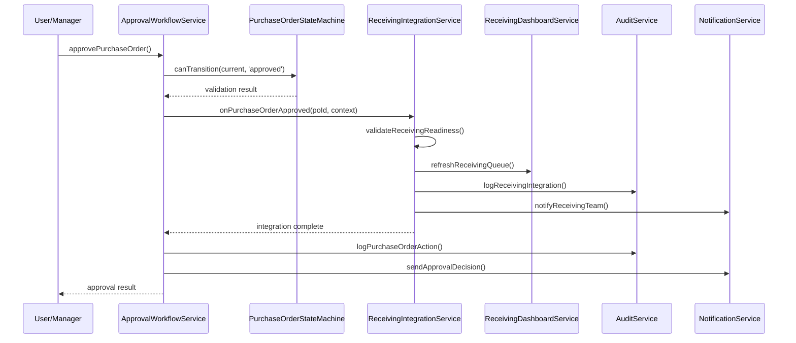

# Design Document

## Overview

The approved purchase order receiving integration addresses a critical workflow gap in the current FBMS system. Currently, when purchase orders are approved through the `approvalWorkflowService`, they do not automatically appear in the receiving queue managed by `receivingDashboardService`. This creates operational friction and potential inventory discrepancies.

The design integrates the existing approval workflow with the receiving dashboard by implementing event-driven updates and real-time synchronization between these two subsystems.

## Architecture

### Current System Analysis

**Approval System Components:**
- `approvalWorkflowService.ts`: Handles purchase order approvals and status transitions
- `purchaseOrderStateMachine.ts`: Manages valid status transitions 
- `enhancedPurchaseOrderStore.ts`: State management with audit integration

**Receiving System Components:**
- `receivingDashboardService.ts`: Manages receiving queue and metrics
- `receivingService.ts`: Handles receiving operations
- Database query uses `enhanced_status` field directly (lines 96-100 in receivingDashboardService.ts)

**Key Integration Points:**
- Purchase orders use `EnhancedPurchaseOrderStatus` enum with states: `'draft' | 'pending_approval' | 'approved' | 'sent_to_supplier' | 'partially_received' | 'fully_received' | 'cancelled' | 'closed'`
- Receiving queue filters for statuses: `['approved', 'sent_to_supplier', 'partially_received']`
- Status transitions are managed through `purchaseOrderStateMachine`

### Solution Architecture



### Integration Strategy

**Event-Driven Integration:**
- Implement `ReceivingIntegrationService` to handle the bridge between approval and receiving
- Use callback pattern in `approvalWorkflowService` to trigger receiving updates
- Maintain existing audit trails and notification systems

**Real-time Updates:**
- Integrate with existing Zustand store for immediate UI updates
- Implement optimistic updates with error recovery
- Use existing `receivingDashboardService.getReceivingQueue()` method for data fetching

## Components and Interfaces

### 1. ReceivingIntegrationService

**Purpose:** Bridge between approval workflow and receiving dashboard

```typescript
interface ReceivingIntegrationService {
  onPurchaseOrderApproved(
    purchaseOrderId: string,
    approvalContext: ApprovalContext
  ): Promise<IntegrationResult>;
  
  onPurchaseOrderStatusChanged(
    purchaseOrderId: string,
    previousStatus: EnhancedPurchaseOrderStatus,
    newStatus: EnhancedPurchaseOrderStatus,
    context: StatusChangeContext
  ): Promise<IntegrationResult>;

  validateReceivingReadiness(
    purchaseOrder: EnhancedPurchaseOrder
  ): ValidationResult;

  refreshReceivingQueue(): Promise<void>;
}

interface ApprovalContext {
  approvedBy: string;
  approvedAt: Date;
  reason: string;
  comments?: string;
  userRole: UserRole;
}

interface IntegrationResult {
  success: boolean;
  receivingQueueUpdated: boolean;
  error?: string;
  notificationsSent: number;
  auditLogId?: string;
}
```

### 2. Enhanced ApprovalWorkflowService

**Modifications:** Add receiving integration hooks to existing approval methods

```typescript
// In approvalWorkflowService.ts - modify existing approvePurchaseOrder method
async approvePurchaseOrder(
  purchaseOrder: PurchaseOrder,
  request: ApprovalRequest,
  userRole: UserRole
): Promise<ApprovalResult> {
  // ... existing approval logic ...
  
  // NEW: Integrate with receiving after successful approval
  if (result.success) {
    await receivingIntegrationService.onPurchaseOrderApproved(
      purchaseOrder.id,
      {
        approvedBy: request.userId,
        approvedAt: new Date(request.timestamp),
        reason: request.reason,
        comments: request.comments,
        userRole
      }
    );
  }
  
  return result;
}
```

### 3. Enhanced ReceivingDashboardService

**Modifications:** Add real-time update capabilities and integration hooks

```typescript
// Add to existing receivingDashboardService.ts
interface ReceivingQueueUpdateResult {
  added: EnhancedPurchaseOrder[];
  updated: EnhancedPurchaseOrder[];
  removed: string[];
}

async onReceivingIntegrationEvent(
  eventType: 'approval' | 'status_change' | 'cancellation',
  purchaseOrderId: string,
  context: any
): Promise<ReceivingQueueUpdateResult>;

async validatePurchaseOrderForReceiving(
  purchaseOrder: EnhancedPurchaseOrder
): Promise<ValidationResult>;
```

### 4. Store Integration

**Modifications:** Extend existing `enhancedPurchaseOrderStore` with receiving integration

```typescript
interface ReceivingIntegrationState {
  // Add to existing enhancedPurchaseOrderStore state
  receivingQueueSyncStatus: 'idle' | 'syncing' | 'error';
  lastReceivingSync: Date | null;
  receivingIntegrationErrors: IntegrationError[];
  
  // New actions
  syncWithReceivingQueue: (purchaseOrderId?: string) => Promise<void>;
  clearReceivingIntegrationErrors: () => void;
  retryFailedReceivingIntegration: (purchaseOrderId: string) => Promise<void>;
}
```

## Data Models

### Enhanced Purchase Order Status Flow

```typescript
// Status transition rules for receiving integration
const RECEIVABLE_STATUSES: EnhancedPurchaseOrderStatus[] = [
  'approved',           // Just approved - ready for receiving
  'sent_to_supplier',   // Sent to supplier - awaiting delivery  
  'partially_received'  // Partial delivery - remaining items expected
];

// Integration event types
interface ReceivingIntegrationEvent {
  id: string;
  purchaseOrderId: string;
  eventType: 'po_approved' | 'po_status_changed' | 'po_cancelled';
  timestamp: Date;
  triggeringUser: string;
  context: Record<string, unknown>;
  processingStatus: 'pending' | 'processed' | 'failed';
  retryCount: number;
  errorMessage?: string;
}
```

### Receiving Queue Item Enhancement

```typescript
// Extend existing ReceivingQueueItem interface
interface EnhancedReceivingQueueItem extends ReceivingQueueItem {
  approvalDetails: {
    approvedBy: string;
    approvedAt: Date;
    approvalReason: string;
    approverRole: UserRole;
  };
  integrationMetadata: {
    addedToQueueAt: Date;
    integrationEventId: string;
    syncStatus: 'synced' | 'pending' | 'error';
  };
}
```

## Error Handling

### Integration Failure Recovery

**Retry Strategy:**
- Automatic retry with exponential backoff (3 attempts)
- Manual retry option for persistent failures
- Error logging with full context preservation

**Error Types:**
```typescript
interface IntegrationError {
  id: string;
  purchaseOrderId: string;
  errorType: 'network' | 'validation' | 'permission' | 'system';
  message: string;
  stackTrace?: string;
  timestamp: Date;
  retryAttempts: number;
  resolved: boolean;
}
```

**Fallback Mechanisms:**
- Queue immediate refresh if real-time update fails
- Preserve audit trail even during integration failures
- Graceful degradation to manual receiving queue refresh

### Data Consistency

**Validation Checks:**
```typescript
interface ReceivingValidation {
  hasRequiredFields: boolean;
  supplierExists: boolean;
  itemsValidated: boolean;
  expectedDateSet: boolean;
  approvalComplete: boolean;
  noBlockingIssues: boolean;
}
```

**Consistency Monitoring:**
- Periodic sync verification (every 15 minutes)
- Integrity checks on receiving queue content
- Alerting for sync discrepancies

## Testing Strategy

### Unit Tests

**ReceivingIntegrationService Tests:**
- Approval event handling
- Status change event processing
- Validation logic
- Error recovery mechanisms
- Audit trail generation

**Integration Tests:**
- Complete approval → receiving flow
- Bulk approval integration
- Error scenario handling
- Performance under load

### Integration Test Scenarios

**Primary Flow:**
1. Create draft purchase order
2. Submit for approval
3. Approve purchase order
4. Verify automatic appearance in receiving queue
5. Verify receiving dashboard metrics update

**Error Scenarios:**
1. Network failure during integration
2. Invalid purchase order data
3. Receiving service unavailable
4. Concurrent approval operations

**Performance Tests:**
- Bulk approval integration (100+ POs)
- Real-time update latency measurement
- Memory usage during integration
- Database query performance impact

### Test Data Requirements

```typescript
// Test data factory extensions
interface ReceivingIntegrationTestData {
  approvablePurchaseOrders: PurchaseOrder[];
  receivingQueueSnapshots: EnhancedPurchaseOrder[];
  approvalContexts: ApprovalContext[];
  integrationFailureScenarios: IntegrationError[];
}
```

## Security and Permissions

### Access Control Integration

**Existing System Compatibility:**
- Leverage existing `purchaseOrderPermissions.ts` validation
- Maintain role-based access control for receiving operations
- Preserve audit trail integrity

**Receiving-Specific Permissions:**
- Validate user can access receiving dashboard
- Check receiving operation permissions
- Maintain separation between approval and receiving roles

### Audit Trail Enhancement

**Extended Logging:**
```typescript
interface ReceivingIntegrationAuditLog extends PurchaseOrderAuditLog {
  integrationEventId: string;
  receivingQueueChange: 'added' | 'updated' | 'removed';
  integrationTimestamp: Date;
  integrationLatency: number;
  notificationsSent: string[];
}
```

## Performance Considerations

### Optimization Strategies

**Database Efficiency:**
- Use existing `enhanced_status` column indexing
- Batch receiving queue updates
- Implement query result caching (5-minute TTL)

**Real-time Updates:**
- Debounce multiple rapid approvals (500ms window)
- Optimize WebSocket/polling for receiving dashboard
- Use existing Zustand persistence for offline resilience

**Monitoring Metrics:**
- Integration event processing time
- Receiving queue refresh latency
- Error rate and retry success rate
- User experience impact measurement

### Scalability Considerations

- Event queue for high-volume approval processing
- Database connection pooling for receiving queries  
- Graceful degradation during system overload
- Horizontal scaling compatibility for future growth