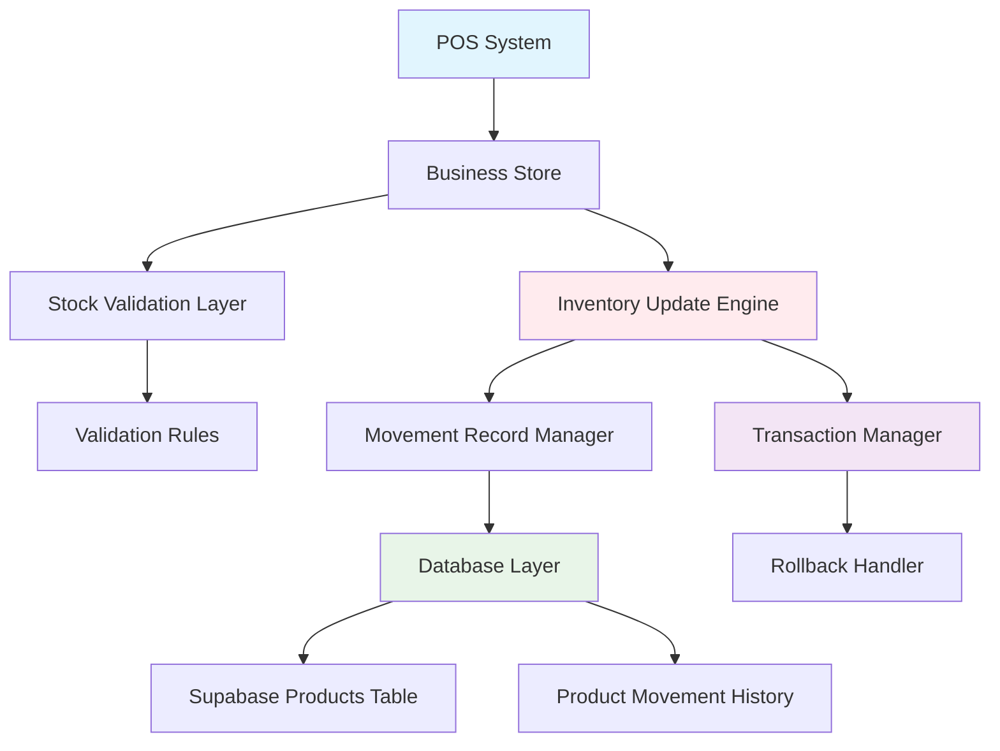
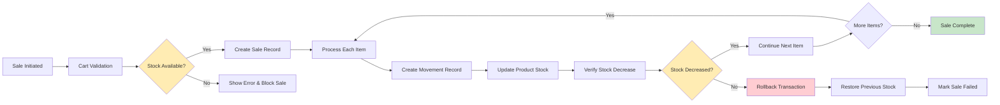
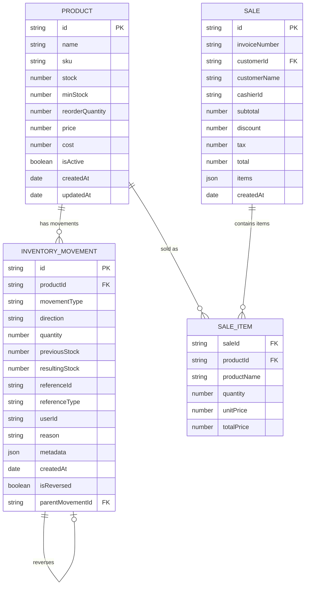
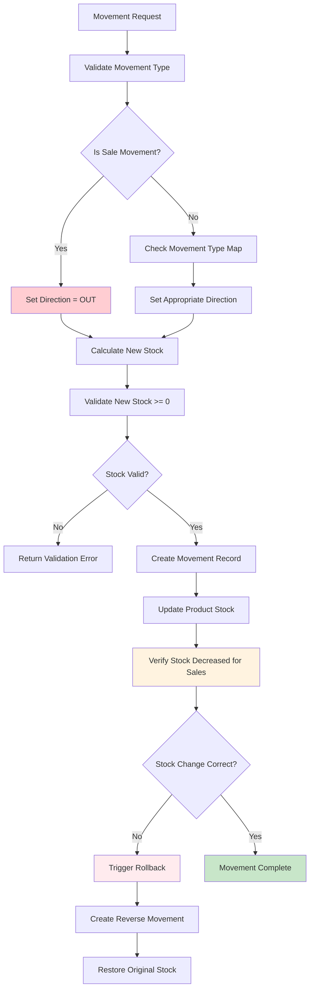
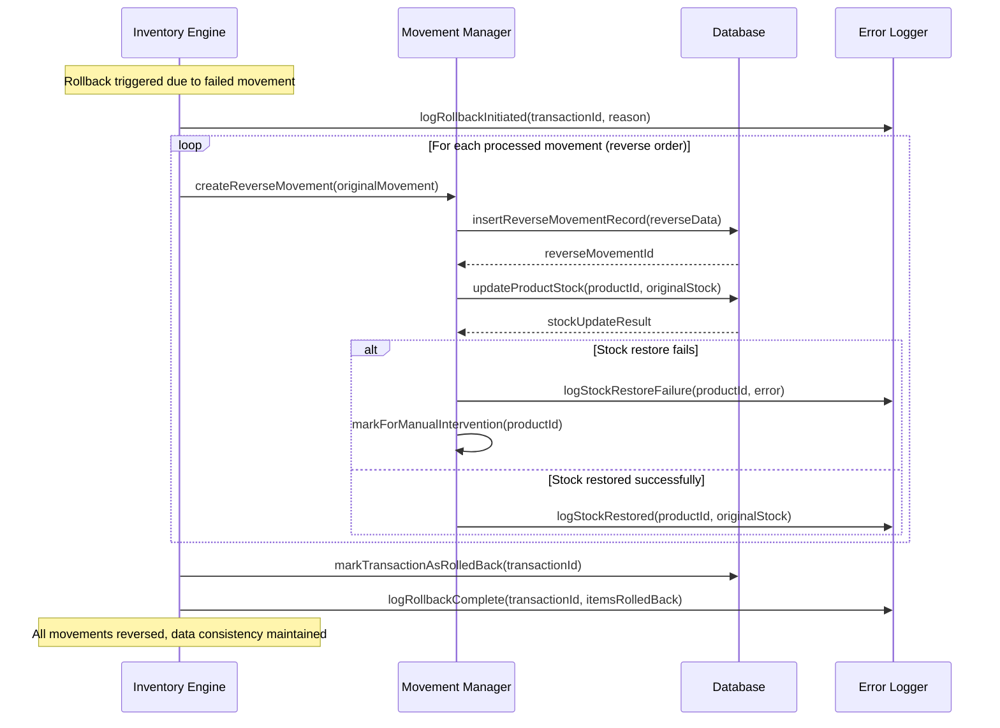

yes# Design Document - POS Inventory Bug Fix

## Overview

This design document addresses a critical bug in the Point of Sale (POS) system where inventory quantities are incorrectly increased instead of decreased during sales transactions. The bug occurs in the inventory deduction logic during the `createSale` and `createOfflineSale` processes, where stock movements are being processed incorrectly, leading to inventory increases rather than decreases.

### Problem Analysis

Based on code analysis, the issue appears to be in the `createMovementRecord` method in `businessStore.ts` where the stock calculation logic may have incorrect sign handling for sales transactions. The method processes stock movements but the directionality of stock changes for sales is not being handled correctly.

### Design Goals

1. **Correct Inventory Deduction**: Ensure sales transactions properly decrease inventory quantities
2. **Data Integrity**: Maintain transactional integrity and prevent data corruption
3. **Audit Trail**: Preserve complete audit trail for all inventory movements
4. **Error Recovery**: Provide robust error handling and rollback capabilities
5. **Performance**: Maintain system performance while ensuring data accuracy

## Architecture Design

### System Architecture Diagram



### Data Flow Diagram



## Component Design

### Core Components

#### 1. InventoryUpdateEngine
- **Responsibilities**: 
  - Coordinate inventory updates during sales transactions
  - Ensure atomic operations across multiple products
  - Handle transaction rollbacks on failures
- **Interfaces**: 
  - `processInventoryDeduction(saleItems: SaleItem[]): Promise<InventoryUpdateResult>`
  - `rollbackInventoryChanges(movementIds: string[]): Promise<void>`
- **Dependencies**: 
  - MovementRecordManager
  - StockValidationLayer
  - TransactionManager

#### 2. MovementRecordManager
- **Responsibilities**: 
  - Create accurate stock movement records
  - Handle stock direction calculations correctly
  - Maintain movement history integrity
- **Interfaces**: 
  - `createSaleMovement(productId: string, quantity: number, saleData: SaleMetadata): Promise<MovementRecord>`
  - `calculateStockDirection(movementType: MovementType): StockDirection`
- **Dependencies**: 
  - Database Layer
  - Audit Service

#### 3. StockValidationLayer
- **Responsibilities**: 
  - Pre-transaction stock validation
  - Concurrent transaction conflict detection
  - Post-transaction verification
- **Interfaces**: 
  - `validateSaleStock(cartItems: CartItem[]): StockValidationResult`
  - `verifyStockDecrease(productId: string, expectedDecrease: number): boolean`
- **Dependencies**: 
  - Product Repository
  - Validation Rules Engine

#### 4. TransactionManager
- **Responsibilities**: 
  - Manage atomic transactions
  - Coordinate rollback operations
  - Handle concurrent access conflicts
- **Interfaces**: 
  - `beginTransaction(): Promise<TransactionContext>`
  - `commitTransaction(context: TransactionContext): Promise<void>`
  - `rollbackTransaction(context: TransactionContext): Promise<void>`
- **Dependencies**: 
  - Database Connection Manager

## Data Model

### Core Data Structure Definitions

```typescript
interface InventoryMovement {
  id: string;
  productId: string;
  movementType: MovementType;
  direction: StockDirection; // 'IN' | 'OUT'
  quantity: number;
  previousStock: number;
  resultingStock: number;
  referenceId?: string;
  referenceType: string;
  userId?: string;
  reason: string;
  metadata: MovementMetadata;
  createdAt: Date;
  isReversed: boolean;
  parentMovementId?: string;
}

enum MovementType {
  SALE = 'sale',
  PURCHASE = 'purchase',
  ADJUSTMENT_IN = 'adjustment_in',
  ADJUSTMENT_OUT = 'adjustment_out',
  TRANSFER_IN = 'transfer_in',
  TRANSFER_OUT = 'transfer_out',
  RETURN_IN = 'return_in',
  RETURN_OUT = 'return_out',
  DAMAGE = 'damage',
  SHRINKAGE = 'shrinkage'
}

enum StockDirection {
  IN = 'IN',   // Increases inventory
  OUT = 'OUT'  // Decreases inventory
}

interface MovementMetadata {
  productName: string;
  productSku?: string;
  invoiceNumber?: string;
  customerName?: string;
  customerId?: string;
  unitCost: number;
  totalCost: number;
  location: string;
  timestamp: string;
  batchNumber?: string;
  expiryDate?: Date;
}

interface InventoryUpdateResult {
  success: boolean;
  processedMovements: ProcessedMovement[];
  failedMovements: FailedMovement[];
  totalItemsProcessed: number;
  rollbackRequired: boolean;
  error?: string;
}

interface ProcessedMovement {
  productId: string;
  movementId: string;
  previousStock: number;
  newStock: number;
  quantityChanged: number;
}

interface FailedMovement {
  productId: string;
  error: string;
  attemptedQuantity: number;
  availableStock: number;
}
```

### Data Model Diagrams



## Business Process

### Process 1: Sale Transaction with Inventory Deduction

```mermaid
sequenceDiagram
    participant POS as POS System
    participant Store as Business Store
    participant Validator as Stock Validator
    participant Engine as Inventory Engine
    participant Manager as Movement Manager
    participant DB as Database
    
    POS->>Store: createSale(saleData)
    Store->>Validator: validateSaleStock(cartItems)
    Validator-->>Store: ValidationResult
    
    alt Stock validation fails
        Store-->>POS: Error: Insufficient Stock
    else Stock validation passes
        Store->>Engine: processInventoryDeduction(saleItems)
        
        loop For each sale item
            Engine->>Manager: createSaleMovement(productId, quantity, saleData)
            Manager->>Manager: calculateStockDirection(SALE)
            Note over Manager: Direction = OUT (decrease stock)
            Manager->>Manager: calculateNewStock(currentStock - quantity)
            Manager->>DB: createMovementRecord(movementData)
            DB-->>Manager: movementId
            Manager->>DB: updateProductStock(productId, newStock)
            Manager-->>Engine: movementResult
            
            alt Movement creation fails
                Engine->>Engine: markRollbackRequired()
                break Rollback transaction
            end
        end
        
        alt Rollback required
            Engine->>Manager: rollbackInventoryChanges(processedMovements)
            loop For each processed movement
                Manager->>DB: createReverseMovement(originalMovement)
                Manager->>DB: restoreProductStock(productId, originalStock)
            end
            Engine-->>Store: Error: Transaction rolled back
            Store-->>POS: Error: Sale failed - inventory not updated
        else All movements successful
            Engine-->>Store: Success: All inventory updated
            Store->>Store: completeSaleTransaction(sale)
            Store-->>POS: Success: Sale created
        end
    end
```

### Process 2: Stock Movement Validation and Verification



### Process 3: Error Recovery and Rollback



## Error Handling Strategy

### Error Classification and Recovery

1. **Validation Errors (Pre-transaction)**
   - **Detection**: Stock validation layer
   - **Recovery**: Block transaction, show user-friendly error
   - **Example**: Insufficient stock, invalid quantities

2. **Transaction Errors (During processing)**
   - **Detection**: Movement record creation or stock updates
   - **Recovery**: Automatic rollback of all processed items
   - **Example**: Database constraints, concurrent modifications

3. **System Errors (Infrastructure)**
   - **Detection**: Database connectivity, service availability
   - **Recovery**: Queue for retry or offline mode
   - **Example**: Network failures, database timeouts

4. **Data Integrity Errors (Post-transaction)**
   - **Detection**: Stock verification checks
   - **Recovery**: Automatic correction or manual intervention
   - **Example**: Stock calculation mismatches

### Error Recovery Mechanisms

```typescript
interface ErrorRecoveryStrategy {
  detectError(error: Error): ErrorClassification;
  determineRecoveryAction(classification: ErrorClassification): RecoveryAction;
  executeRecovery(action: RecoveryAction): Promise<RecoveryResult>;
}

enum ErrorClassification {
  VALIDATION_ERROR = 'validation_error',
  TRANSACTION_ERROR = 'transaction_error', 
  SYSTEM_ERROR = 'system_error',
  DATA_INTEGRITY_ERROR = 'data_integrity_error'
}

enum RecoveryAction {
  BLOCK_TRANSACTION = 'block_transaction',
  ROLLBACK_TRANSACTION = 'rollback_transaction',
  RETRY_OPERATION = 'retry_operation',
  QUEUE_FOR_RETRY = 'queue_for_retry',
  MANUAL_INTERVENTION = 'manual_intervention'
}
```

## Testing Strategy

### Unit Testing Focus Areas

1. **Stock Direction Calculation**
   - Test movement type to direction mapping
   - Verify sales movements always decrease stock
   - Test edge cases for each movement type

2. **Stock Update Logic**
   - Test arithmetic operations for stock changes
   - Verify negative stock prevention
   - Test concurrent update scenarios

3. **Movement Record Creation**
   - Test metadata capture accuracy
   - Verify audit trail completeness
   - Test record linkage and relationships

4. **Rollback Mechanisms**
   - Test partial failure scenarios
   - Verify complete transaction reversal
   - Test rollback order and dependencies

### Integration Testing Scenarios

1. **End-to-End Sale Processing**
   - Complete sale with multiple items
   - Verify all stock decreases correctly
   - Check audit trail accuracy

2. **Concurrent Sales Testing**
   - Multiple simultaneous sales of same products
   - Verify no stock corruption
   - Test conflict resolution

3. **Error Scenario Testing**
   - Database failures during processing
   - Network interruptions
   - Partial transaction failures

4. **Performance Testing**
   - High-volume sales processing
   - Large cart transactions
   - System load under concurrent access

### Acceptance Criteria Validation

1. **Inventory Decreases Correctly**
   - ✓ Single item sale decreases stock by exact amount
   - ✓ Multi-item sale decreases stock for all items  
   - ✓ Same product multiple times aggregates correctly

2. **Data Integrity Maintained**
   - ✓ Atomic transactions (all succeed or all rollback)
   - ✓ No partial updates leave system in inconsistent state
   - ✓ Audit trail captures all changes accurately

3. **Error Handling Works**
   - ✓ Insufficient stock blocks transaction
   - ✓ System errors trigger proper rollback
   - ✓ User receives clear error messages

4. **Performance Requirements Met**
   - ✓ Stock updates complete within 2 seconds
   - ✓ Concurrent transactions don't degrade performance
   - ✓ System remains responsive under load

## Implementation Plan

### Phase 1: Fix Core Bug (Priority: Critical)

1. **Identify and fix stock direction logic in `createMovementRecord`**
   - Review movement type to stock direction mapping
   - Ensure sales movements always decrease inventory
   - Add explicit direction validation

2. **Enhance stock update calculations**
   - Fix arithmetic operations for stock changes
   - Add validation for expected vs actual stock changes
   - Implement post-update verification

### Phase 2: Strengthen Validation (Priority: High)

1. **Improve pre-transaction validation**
   - Enhanced stock validation with better error messages
   - Concurrent transaction conflict detection
   - Real-time stock availability checks

2. **Add post-transaction verification**
   - Verify stock decreased for sales transactions  
   - Detect and alert on unexpected stock changes
   - Automated correction for minor discrepancies

### Phase 3: Error Recovery Enhancement (Priority: Medium)

1. **Robust rollback mechanisms**
   - Comprehensive transaction rollback
   - Movement record reversal
   - Stock restoration with verification

2. **Error monitoring and alerting**
   - Real-time error detection
   - Automated notifications for critical issues
   - Detailed error logging for debugging

### Phase 4: Performance and Monitoring (Priority: Low)

1. **Performance optimization**
   - Batch processing for large transactions
   - Database query optimization
   - Caching for frequently accessed products

2. **Advanced monitoring**
   - Stock movement analytics
   - Performance metrics dashboard
   - Proactive issue detection

## Deployment Strategy

### Pre-deployment Steps

1. **Code Review and Testing**
   - Comprehensive code review focusing on inventory logic
   - Complete unit and integration test execution
   - User acceptance testing in staging environment

2. **Data Backup and Migration Planning**
   - Full database backup before deployment
   - Data migration scripts for any schema changes
   - Rollback procedures documented and tested

### Deployment Process

1. **Staged Rollout**
   - Deploy to staging environment first
   - Limited production deployment to subset of users
   - Full production deployment after validation

2. **Monitoring and Validation**
   - Real-time monitoring of inventory transactions
   - Validation of stock movement accuracy
   - Immediate rollback capability if issues detected

3. **Post-deployment Verification**
   - Execute test transactions across all product types
   - Verify reporting and analytics accuracy
   - Confirm audit trail completeness

This design ensures that the critical POS inventory bug is fixed comprehensively while maintaining system reliability, data integrity, and user experience. The phased approach allows for safe implementation and thorough validation of the fix.