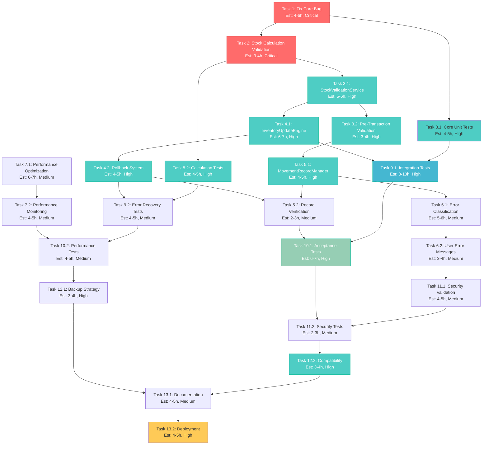

# Implementation Plan - POS Inventory Bug Fix

This document outlines the detailed implementation tasks for fixing the critical inventory deduction bug in the Point of Sale (POS) system where stock is incorrectly increased instead of decreased during sales transactions.

## Task List

- [ ] 1. Identify and Fix Core Stock Direction Bug (Est: 4-6 hours)
  - Analyze and fix the stock direction logic in `createMovementRecord` method in `businessStore.ts`
  - Ensure `STOCK_OUT_TYPES` correctly includes 'sale' and maps to negative stock changes
  - Verify that sales transactions always result in negative stock changes (`stockChange = -quantity`)
  - Add explicit validation that sale movements decrease inventory
  - Add unit tests for the specific bug fix to prevent regression
  - _Requirements: 1.1, 1.2, 1.4_
  - _Priority: Critical_

- [ ] 2. Enhance Stock Calculation Validation (Est: 3-4 hours)
  - Add pre-calculation validation to ensure stock direction is correct for movement type
  - Implement post-calculation verification that stock decreased for sales transactions
  - Add safeguards against incorrect arithmetic operations in stock updates
  - Validate that `newStock = previousStock + stockChange` produces expected results for sales
  - Create comprehensive logging for stock calculation operations
  - _Requirements: 1.1, 2.1, 2.2_
  - _Priority: Critical_

- [ ] 3. Implement Comprehensive Stock Validation Layer (Est: 8-10 hours)
- [ ] 3.1 Create StockValidationService (Est: 5-6 hours)
  - Write comprehensive stock validation service with movement type-specific rules
  - Implement `validateMovementDirection` method to verify movement types map to correct directions
  - Add `validateStockCalculation` method to verify arithmetic operations
  - Create validation rules for each movement type (sale, purchase, adjustment, etc.)
  - Implement caching mechanism for validation rules to improve performance
  - _Requirements: 2.1, 2.4, 7.1, 7.2_
  - _Priority: High_

- [ ] 3.2 Integrate Pre-Transaction Stock Validation (Est: 3-4 hours)
  - Enhance existing `validateSaleStock` method with direction validation
  - Add concurrent transaction conflict detection using optimistic locking
  - Implement real-time stock availability checks before sales processing
  - Add validation for insufficient stock scenarios with detailed error messages including available alternatives
  - Create validation middleware for all inventory operations
  - _Requirements: 1.3, 2.2, 4.1, 4.2_
  - _Priority: High_

- [ ] 4. Create Inventory Update Engine with Transaction Management (Est: 10-12 hours)
- [ ] 4.1 Implement InventoryUpdateEngine Class (Est: 6-7 hours)
  - Create centralized inventory update engine to coordinate stock changes
  - Implement atomic transaction support for multi-item sales using database transactions
  - Add transaction context management for rollback capabilities
  - Create `processInventoryDeduction` method for sales transactions with batch processing
  - Implement circuit breaker pattern for resilience during high load
  - _Requirements: 2.2, 2.3, 4.2_
  - _Priority: High_

- [ ] 4.2 Implement Transaction Rollback System (Est: 4-5 hours)
  - Create `rollbackInventoryChanges` method to reverse failed transactions
  - Implement automatic rollback for partial transaction failures with compensation logic
  - Add rollback verification to ensure stock is properly restored
  - Create rollback audit trail with detailed failure reasons for transparency
  - Implement rollback performance monitoring and alerting
  - _Requirements: 1.5, 2.3, 4.2, 4.4_
  - _Priority: High_

- [ ] 5. Enhance Movement Record Management (Est: 6-8 hours)
- [ ] 5.1 Improve MovementRecordManager (Est: 4-5 hours)
  - Refactor `createMovementRecord` to use centralized direction calculation
  - Add movement type validation before record creation with comprehensive error messages
  - Implement proper error handling for movement record creation failures
  - Add verification that created records match expected stock changes
  - Implement record deduplication to prevent double-processing
  - _Requirements: 3.1, 3.2, 3.3, 3.5_
  - _Priority: High_

- [ ] 5.2 Add Movement Record Verification (Est: 2-3 hours)
  - Implement post-creation verification of movement records
  - Add audit trail validation to ensure record completeness and integrity
  - Create verification methods for stock change accuracy with tolerance checking
  - Add automated correction for minor movement record inconsistencies
  - Implement record validation dashboards for operational monitoring
  - _Requirements: 3.1, 3.4, 3.5_
  - _Priority: Medium_

- [ ] 6. Create Comprehensive Error Handling System (Est: 8-10 hours)
- [ ] 6.1 Implement Error Classification and Recovery (Est: 5-6 hours)
  - Create error classification system for different failure types (validation, transaction, system, integrity)
  - Implement appropriate recovery strategies for each error type with automated decision making
  - Add automated retry logic for transient failures with exponential backoff
  - Create manual intervention triggers for critical errors with escalation procedures
  - Implement error pattern analysis for proactive issue prevention
  - _Requirements: 4.2, 4.3, 4.4, 4.5_
  - _Priority: Medium_

- [ ] 6.2 Enhance User Error Messages and Recovery (Est: 3-4 hours)
  - Improve error messages for insufficient stock scenarios with actionable suggestions
  - Add suggested alternatives when stock is unavailable (similar products, back-ordering)
  - Implement clear error messages for transaction failures with next steps
  - Create user-friendly error recovery options with guided workflows
  - Add multilingual support for error messages based on user preferences
  - _Requirements: 4.1, 4.2, 4.4_
  - _Priority: Medium_

- [ ] 7. Implement Performance Optimization (Est: 10-12 hours)
- [ ] 7.1 Optimize Database Operations (Est: 6-7 hours)
  - Implement batch processing for multiple inventory updates to reduce database round trips
  - Add database query optimization for stock operations with proper indexing strategy
  - Create efficient indexing strategy for movement records with query pattern analysis
  - Implement intelligent caching for frequently accessed product data with cache invalidation
  - Add database connection pooling optimization for concurrent operations
  - _Requirements: 5.1, 5.2, 5.4_
  - _Priority: Medium_

- [ ] 7.2 Add Performance Monitoring (Est: 4-5 hours)
  - Implement comprehensive performance metrics collection for inventory operations
  - Add monitoring for concurrent transaction performance with real-time dashboards
  - Create alerts for performance degradation with threshold-based triggers
  - Add bottleneck identification and reporting with automated recommendations
  - Implement performance trend analysis for capacity planning
  - _Requirements: 5.2, 5.5_
  - _Priority: Medium_

- [ ] 8. Create Unit Tests for Core Bug Fix (Est: 8-10 hours)
- [ ] 8.1 Test Stock Direction Logic (Est: 4-5 hours)
  - Write comprehensive unit tests for movement type to direction mapping
  - Test that sales movements always result in stock decreases under all conditions
  - Create edge case tests for all movement types including boundary conditions
  - Add regression tests to prevent future direction bugs with comprehensive test coverage
  - Implement property-based testing for stock calculation edge cases
  - _Requirements: 7.1, 8.1_
  - _Priority: High_

- [ ] 8.2 Test Stock Calculation Logic (Est: 4-5 hours)
  - Create comprehensive unit tests for stock arithmetic operations
  - Test boundary conditions (zero stock, negative stock prevention, maximum values)
  - Add tests for concurrent stock update scenarios with race condition simulation
  - Create performance tests for stock calculation operations under load
  - Implement fuzz testing for stock calculation robustness
  - _Requirements: 7.2, 8.2_
  - _Priority: High_

- [ ] 9. Create Integration Tests for Sales Process (Est: 12-15 hours)
- [ ] 9.1 Test End-to-End Sale Processing (Est: 8-10 hours)
  - Write comprehensive integration tests for complete sale transactions
  - Test multi-item sales with various movement scenarios and product combinations
  - Verify audit trail accuracy throughout sale process with detailed assertions
  - Test concurrent sales of same products with conflict resolution validation
  - Add integration tests for offline mode scenarios and synchronization
  - _Requirements: 7.1, 7.2, 7.5_
  - _Priority: High_

- [ ] 9.2 Test Error Recovery Scenarios (Est: 4-5 hours)
  - Create integration tests for transaction rollback scenarios with comprehensive coverage
  - Test partial failure recovery in multi-item sales with various failure points
  - Add tests for database failure scenarios including connection issues and timeouts
  - Test system behavior under concurrent access conflicts with load simulation
  - Implement chaos engineering tests for system resilience validation
  - _Requirements: 7.4, 7.5_
  - _Priority: Medium_

- [ ] 10. Create Acceptance Tests (Est: 10-12 hours)
- [ ] 10.1 Create User Acceptance Test Suite (Est: 6-7 hours)
  - Write comprehensive tests for single-item sale stock deduction with various product types
  - Create tests for multi-item sales with same products including variant handling
  - Add tests for insufficient stock prevention with comprehensive error scenarios
  - Test error message clarity and user experience with usability validation
  - Create automated user journey tests covering typical business workflows
  - _Requirements: 7.1, 7.2, 7.3, 8.1, 8.2_
  - _Priority: High_

- [ ] 10.2 Create Performance Acceptance Tests (Est: 4-5 hours)
  - Write tests to verify 2-second stock update performance requirement under normal load
  - Create load tests for concurrent transaction scenarios with realistic traffic patterns
  - Test system responsiveness under high-volume sales with peak load simulation
  - Add stress tests for large cart transactions with maximum item limits
  - Implement endurance tests for long-running system stability validation
  - _Requirements: 5.1, 5.2, 7.5_
  - _Priority: Medium_

- [ ] 11. Implement Security and Access Control Validation (Est: 6-8 hours)
- [ ] 11.1 Add Security Validation for Inventory Operations (Est: 4-5 hours)
  - Verify user permissions for inventory modification operations with role-based access control
  - Add comprehensive audit logging for all inventory changes with user attribution and IP tracking
  - Implement role-based access control for inventory adjustments with granular permissions
  - Add security validation for POS transaction processing with authentication verification
  - Implement security monitoring for suspicious inventory operations with alert thresholds
  - _Requirements: 8.1, 8.2, 8.4_
  - _Priority: Medium_

- [ ] 11.2 Create Security Tests (Est: 2-3 hours)
  - Write comprehensive tests for unauthorized inventory access attempts
  - Test role-based permission enforcement with various user roles and scenarios
  - Add tests for audit logging completeness with tamper detection
  - Create tests for sensitive operation authentication requirements including multi-factor authentication
  - Implement penetration testing scenarios for inventory-related security vulnerabilities
  - _Requirements: 8.3, 8.5_
  - _Priority: Medium_

- [ ] 12. Create Data Migration and Backup Strategy (Est: 6-8 hours)
- [ ] 12.1 Implement Data Backup Procedures (Est: 3-4 hours)
  - Create automated backup procedures before deployment with verification
  - Implement data validation checks for existing inventory data with integrity verification
  - Add rollback procedures for deployment failures with automated restore capabilities
  - Create data integrity verification scripts with comprehensive validation rules
  - Implement backup testing procedures to ensure restore capability
  - _Requirements: 6.1, 6.5_
  - _Priority: High_

- [ ] 12.2 Ensure Backward Compatibility (Est: 3-4 hours)
  - Validate existing product and inventory data compatibility with new system
  - Test existing transaction format support with comprehensive format validation
  - Verify API contract compatibility with external systems including version compatibility
  - Ensure user interface compatibility with existing workflows and user training requirements
  - Implement migration validation tools for data consistency verification
  - _Requirements: 6.2, 6.3, 6.4_
  - _Priority: High_

- [ ] 13. Create Comprehensive Documentation and Deployment Plan (Est: 8-10 hours)
- [ ] 13.1 Create Technical Documentation (Est: 4-5 hours)
  - Document all code changes and bug fix implementations with detailed explanations
  - Create comprehensive troubleshooting guide for inventory-related issues
  - Document new validation rules and error handling procedures with examples
  - Create detailed deployment and rollback procedures with step-by-step instructions
  - Implement automated documentation generation and maintenance procedures
  - _Implementation support for all requirements_
  - _Priority: Medium_

- [ ] 13.2 Execute Staged Deployment (Est: 4-5 hours)
  - Deploy to staging environment with comprehensive testing and validation
  - Execute limited production deployment with real-time monitoring and user feedback
  - Perform full production deployment with validation and performance monitoring
  - Create post-deployment verification and monitoring procedures with success criteria
  - Implement deployment automation and monitoring dashboards
  - _Implementation support for all requirements_
  - _Priority: High_

## Enhanced Task Dependencies and Critical Path

### Critical Path Tasks (Must be completed in order):
1. Task 1 (Core Bug Fix) → Task 2 (Stock Validation) → Task 8.1 (Core Unit Tests) → Task 9.1 (Integration Tests) → Task 10.1 (Acceptance Tests) → Task 13.2 (Deployment)

### Parallel Development Streams:
- **Core Fix Stream**: Tasks 1, 2, 8.1 (Critical path)
- **Validation Stream**: Tasks 3.1, 3.2, 4.1, 4.2
- **Testing Stream**: Tasks 8.2, 9.2, 10.2, 11.2 (Can be developed in parallel)
- **Operations Stream**: Tasks 7.1, 7.2, 12.1, 12.2, 13.1

### Risk Mitigation Tasks:
- Task 4.2 (Rollback System) - Critical for data safety
- Task 6.1 (Error Handling) - Essential for system reliability
- Task 12.1 (Backup Strategy) - Required before deployment

## Task Priority Matrix

### Critical Priority (Complete First):
- Tasks 1, 2, 8.1, 12.1, 13.2

### High Priority (Complete Next):
- Tasks 3.1, 3.2, 4.1, 4.2, 5.1, 8.2, 9.1, 10.1, 12.2

### Medium Priority (Complete After High):
- Tasks 5.2, 6.1, 6.2, 7.1, 7.2, 9.2, 10.2, 11.1, 11.2, 13.1

## Estimated Total Effort: 135-165 hours (17-21 working days for a team of 2-3 developers)

## Tasks Dependency Diagram

## Quality Assurance Checkpoints

### Checkpoint 1: Core Bug Fix Validation (After Task 2)
- [ ] Stock direction logic correctly implemented
- [ ] Sales transactions decrease inventory
- [ ] Unit tests pass with 100% coverage for bug fix

### Checkpoint 2: System Integration Validation (After Task 9.1)
- [ ] End-to-end sales process works correctly
- [ ] All integration tests pass
- [ ] Performance requirements met

### Checkpoint 3: Production Readiness (After Task 12.2)
- [ ] All acceptance tests pass
- [ ] Security validation complete
- [ ] Backup and rollback procedures tested
- [ ] Documentation complete

### Checkpoint 4: Deployment Success (After Task 13.2)
- [ ] Staging deployment successful
- [ ] Production deployment validated
- [ ] Post-deployment monitoring active
- [ ] User acceptance confirmed

This comprehensive task list ensures systematic resolution of the POS inventory bug while maintaining system reliability, data integrity, and optimal user experience.