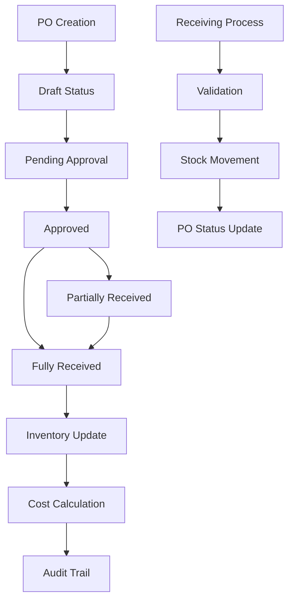

# Design Document

## Overview

This design document outlines the architecture for fixing purchase order deduction issues and implementing an improved workflow for purchase order management and receiving. The solution addresses inventory synchronization problems, establishes clear status transitions, implements partial receiving capabilities, and ensures proper audit trails for all stock movements.

## Architecture

### Core Components

1. **Purchase Order State Machine**: Manages valid status transitions and business rules
2. **Receiving Service**: Handles goods receipt processing with inventory updates
3. **Inventory Integration Layer**: Ensures consistent stock adjustments across the system
4. **Audit Service**: Tracks all inventory movements and purchase order changes
5. **Validation Engine**: Enforces business rules and prevents invalid operations
6. **Cost Accounting Module**: Manages weighted average cost calculations

### Data Flow Architecture



## Components and Interfaces

### 1. Enhanced Purchase Order Types

```typescript
interface EnhancedPurchaseOrder extends PurchaseOrder {
  statusHistory: StatusTransition[];
  receivingHistory: ReceivingRecord[];
  validationErrors: ValidationError[];
}

interface StatusTransition {
  id: string;
  fromStatus: PurchaseOrderStatus;
  toStatus: PurchaseOrderStatus;
  timestamp: Date;
  performedBy: string;
  reason?: string;
}

interface ReceivingRecord {
  id: string;
  receivedDate: Date;
  receivedBy: string;
  items: PartialReceiptItem[];
  notes?: string;
}

interface PartialReceiptItem {
  productId: string;
  orderedQuantity: number;
  receivedQuantity: number;
  previouslyReceived: number;
  totalReceived: number;
  condition: 'good' | 'damaged' | 'expired';
}
```

### 2. Purchase Order State Machine

```typescript
class PurchaseOrderStateMachine {
  private readonly validTransitions: Map<PurchaseOrderStatus, PurchaseOrderStatus[]>;
  
  constructor() {
    this.validTransitions = new Map([
      ['draft', ['pending', 'cancelled']],
      ['pending', ['approved', 'cancelled']],
      ['approved', ['partially_received', 'fully_received', 'cancelled']],
      ['partially_received', ['fully_received', 'cancelled']],
      ['fully_received', []],
      ['cancelled', []]
    ]);
  }

  canTransition(from: PurchaseOrderStatus, to: PurchaseOrderStatus): boolean;
  validateTransition(purchaseOrder: PurchaseOrder, newStatus: PurchaseOrderStatus): ValidationResult;
  executeTransition(purchaseOrder: PurchaseOrder, newStatus: PurchaseOrderStatus, context: TransitionContext): Promise<PurchaseOrder>;
}
```

### 3. Receiving Service

```typescript
interface ReceivingService {
  processReceipt(
    purchaseOrderId: string,
    receipts: PartialReceiptItem[],
    receivedBy: string,
    notes?: string
  ): Promise<ReceiptProcessingResult>;
  
  validateReceipt(
    purchaseOrder: PurchaseOrder,
    receipts: PartialReceiptItem[]
  ): ValidationResult;
  
  calculateInventoryAdjustments(
    purchaseOrder: PurchaseOrder,
    receipts: PartialReceiptItem[]
  ): InventoryAdjustment[];
  
  applyInventoryAdjustments(adjustments: InventoryAdjustment[]): Promise<void>;
}
```

### 4. Enhanced Inventory Integration

```typescript
interface InventoryAdjustment {
  productId: string;
  quantityChange: number;
  unitCost: number;
  totalCost: number;
  movementType: 'purchase_receipt';
  referenceId: string;
  batchNumber?: string;
  expiryDate?: Date;
}

interface StockMovementService {
  recordMovement(movement: StockMovementRequest): Promise<StockMovement>;
  updateWeightedAverageCost(productId: string, newCost: number, quantity: number): Promise<void>;
  validateStockMovement(movement: StockMovementRequest): ValidationResult;
}
```

## Data Models

### Enhanced Purchase Order Status

The current system uses: `'draft' | 'sent' | 'received' | 'partial' | 'cancelled'`

**Recommended Enhanced Status Model:**
```typescript
type EnhancedPurchaseOrderStatus = 
  | 'draft'              // Being created/edited
  | 'pending_approval'   // Awaiting approval
  | 'approved'           // Approved for ordering
  | 'sent_to_supplier'   // Sent to supplier
  | 'partially_received' // Some items received
  | 'fully_received'     // All items received
  | 'cancelled'          // Cancelled order
  | 'closed';            // Completed and closed

interface StatusTransitionRules {
  draft: ['pending_approval', 'cancelled'];
  pending_approval: ['approved', 'draft', 'cancelled'];
  approved: ['sent_to_supplier', 'partially_received', 'cancelled'];
  sent_to_supplier: ['partially_received', 'fully_received', 'cancelled'];
  partially_received: ['fully_received'];
  fully_received: ['closed'];
  cancelled: [];
  closed: [];
}
```

### Enhanced Purchase Order Item

```typescript
interface EnhancedPurchaseOrderItem extends PurchaseOrderItem {
  receivedQuantity: number;
  pendingQuantity: number;
  receivingHistory: ReceiptLineItem[];
  qualityStatus: 'pending' | 'approved' | 'rejected';
  damageReports?: DamageReport[];
}

interface ReceiptLineItem {
  date: Date;
  quantity: number;
  condition: 'good' | 'damaged' | 'expired';
  receivedBy: string;
  batchNumber?: string;
  expiryDate?: Date;
  notes?: string;
}
```

### Audit Trail Schema

```typescript
interface PurchaseOrderAuditLog {
  id: string;
  purchaseOrderId: string;
  action: 'created' | 'updated' | 'status_changed' | 'received' | 'cancelled';
  performedBy: string;
  timestamp: Date;
  oldValues?: Record<string, any>;
  newValues?: Record<string, any>;
  reason?: string;
  metadata?: Record<string, any>;
}

interface InventoryMovementAuditLog {
  id: string;
  productId: string;
  movementType: string;
  quantityBefore: number;
  quantityAfter: number;
  quantityChanged: number;
  unitCost?: number;
  totalValue?: number;
  referenceType: 'purchase_order' | 'sale' | 'adjustment' | 'transfer';
  referenceId: string;
  performedBy: string;
  timestamp: Date;
  reason: string;
}
```

## Error Handling

### Validation Framework

```typescript
interface ValidationRule<T> {
  validate(data: T): ValidationResult;
  getErrorMessage(): string;
}

class PurchaseOrderValidationRules {
  static validateReceiptQuantities: ValidationRule<PartialReceiptItem[]>;
  static validateStatusTransition: ValidationRule<StatusTransitionRequest>;
  static validateInventoryAvailability: ValidationRule<InventoryAdjustment[]>;
  static validateUserPermissions: ValidationRule<PermissionContext>;
}
```

### Error Recovery Mechanisms

1. **Idempotent Operations**: All receiving operations can be safely retried
2. **Compensation Actions**: Automatic rollback of partial operations on failure
3. **Dead Letter Queue**: Failed operations are queued for manual review
4. **Audit Reconciliation**: Daily reconciliation reports for stock movements

## Testing Strategy

### Unit Testing

1. **State Machine Testing**: Verify all valid and invalid state transitions
2. **Receiving Logic Testing**: Test partial receipt calculations and inventory updates
3. **Cost Calculation Testing**: Validate weighted average cost computations
4. **Validation Testing**: Test all business rule validations

### Integration Testing

1. **Database Transaction Testing**: Ensure ACID properties for complex operations
2. **API Integration Testing**: Test purchase order and inventory API interactions
3. **User Permission Testing**: Validate role-based access controls
4. **Audit Trail Testing**: Verify complete audit logging

### End-to-End Testing

1. **Complete Purchase Order Lifecycle**: From creation to closure
2. **Partial Receiving Scenarios**: Multiple partial receipts for single orders
3. **Error Recovery Testing**: System behavior during failures
4. **Performance Testing**: Large batch receiving operations

## Security and Permissions

### Role-Based Access Control

```typescript
interface PurchaseOrderPermissions {
  canCreate: boolean;
  canEdit: boolean;
  canApprove: boolean;
  canReceive: boolean;
  canCancel: boolean;
  canViewHistory: boolean;
  maxApprovalAmount?: number;
}

enum UserRole {
  PURCHASER = 'purchaser',
  APPROVER = 'approver',
  RECEIVER = 'receiver',
  WAREHOUSE_MANAGER = 'warehouse_manager',
  FINANCE_MANAGER = 'finance_manager',
  ADMIN = 'admin'
}
```

### Audit and Compliance

1. **Complete Audit Trail**: Every action is logged with user, timestamp, and reason
2. **Data Integrity Checks**: Regular validation of stock levels against movements
3. **Approval Workflows**: Configurable approval chains based on amount thresholds
4. **Segregation of Duties**: Different users for creation, approval, and receiving

## Performance Considerations

### Optimization Strategies

1. **Batch Processing**: Group multiple receipt lines for single database transaction
2. **Lazy Loading**: Load purchase order details only when needed
3. **Caching Strategy**: Cache frequently accessed supplier and product data
4. **Database Indexing**: Optimize queries for status filters and date ranges

### Monitoring and Metrics

1. **Receipt Processing Time**: Track time from goods arrival to system update
2. **Error Rates**: Monitor validation failures and system errors
3. **Approval Bottlenecks**: Identify delays in approval workflows
4. **Inventory Accuracy**: Regular reconciliation between physical and system counts

## Migration Strategy

### Database Schema Changes

1. Add new status values to purchase_orders table
2. Create purchase_order_audit_log table
3. Create receiving_records table
4. Add receivedQuantity column to purchase order items
5. Create status_transitions table

### Data Migration

1. **Status Normalization**: Map existing statuses to new enhanced statuses
2. **Historical Data**: Preserve existing purchase order history
3. **Audit Backfill**: Create initial audit records for existing data
4. **Validation**: Verify data integrity after migration

### Rollback Plan

1. **Schema Rollback Scripts**: Revert database changes if needed
2. **Data Preservation**: Backup all data before migration
3. **Feature Flags**: Allow switching between old and new workflows
4. **Gradual Rollout**: Phase implementation across different user groups