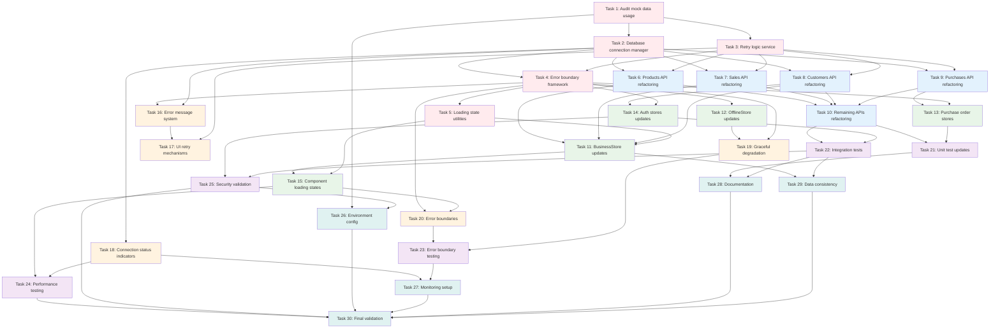

# Implementation Plan: Remove Mock Data Integration

## Overview

This implementation plan provides a comprehensive roadmap for removing all mock data implementations from the FBMS system while ensuring robust database-only operations. The plan follows a 5-phase approach designed to maintain system stability throughout the transition.

**Objective:** Eliminate the Mock Data mode entirely and ensure the system operates exclusively with live Supabase database integration, providing proper error handling and graceful degradation when database connectivity fails.

## Implementation Tasks

### Phase 1: Foundation Setup and Analysis

- [ ] 1. Audit and document current mock data usage across the system
  - Perform comprehensive code search to identify all mock data implementations
  - Document existing fallback mechanisms in API services and stores
  - Create inventory of test data factories and their usage
  - Map dependencies between mock data and production code
  - _Requirements: 1.4, 8.1, 8.4_

- [ ] 2. Create database connection health monitoring system
  - Implement `DatabaseConnectionManager` class with connection status tracking
  - Add connection health check methods with timeout handling
  - Create connection status enum and state management
  - Implement real-time connection status updates
  - _Requirements: 6.3, 10.2, 10.5_

- [ ] 3. Implement retry logic service with exponential backoff
  - Create `RetryService` utility class with configurable retry options
  - Implement exponential backoff algorithm (1s, 2s, 4s, 8s, 16s)
  - Add maximum retry attempt limits and circuit breaker functionality
  - Create retry configuration interface and default settings
  - _Requirements: 2.3, 9.2, 9.3_

- [ ] 4. Set up error boundary framework
  - Create base `DatabaseErrorBoundary` React component
  - Implement error fallback UI components with retry options
  - Add error logging and monitoring integration
  - Create error boundary provider for component tree wrapping
  - _Requirements: 9.1, 9.5, 9.6_

- [ ] 5. Create loading state management utilities
  - Implement `LoadingStateManager` with centralized loading state tracking
  - Create loading UI components (spinners, skeleton screens)
  - Add timeout handling for long-running operations
  - Implement loading state persistence during navigation
  - _Requirements: 3.1, 3.4, 3.6_

### Phase 2: API Service Refactoring

- [ ] 6. Remove mock data fallbacks from products API service
  - Update `src/api/products.ts` to remove any mock data fallbacks
  - Implement database-only CRUD operations with proper error handling
  - Add validation for required database connection before operations
  - Update response handling to return database errors instead of mock data
  - _Requirements: 4.1, 4.4, 4.5_

- [ ] 7. Remove mock data fallbacks from sales API service
  - Update `src/api/sales.ts` to eliminate mock data fallbacks
  - Ensure all sales operations require valid database connection
  - Implement proper error responses for failed database operations
  - Add transaction handling for multi-step sales operations
  - _Requirements: 4.1, 4.3, 4.6_

- [ ] 8. Remove mock data fallbacks from customers API service
  - Update `src/api/customers.ts` to remove mock data fallbacks
  - Implement database-only customer CRUD operations
  - Add proper authentication checks for customer data access
  - Update error handling to return specific database error codes
  - _Requirements: 4.2, 6.1, 6.3_

- [ ] 9. Remove mock data fallbacks from purchases API service
  - Update `src/api/purchases.ts` to eliminate mock data fallbacks
  - Ensure purchase order operations require database connectivity
  - Implement proper validation and error handling for purchase operations
  - Add support for partial operations during connectivity issues
  - _Requirements: 4.1, 7.1, 7.2_

- [ ] 10. Update remaining API services for database-only operations
  - Remove mock fallbacks from accounting, payroll, expenses, and user APIs
  - Implement consistent error handling patterns across all API services
  - Add authentication validation to all API operations
  - Update response interfaces to include proper error metadata
  - _Requirements: 4.1, 4.5, 6.1_

### Phase 3: Store and Component Updates

- [ ] 11. Remove mock data initialization from businessStore
  - Update `src/store/businessStore.ts` to remove mock data initialization
  - Implement database-only state initialization with loading states
  - Add error state management for failed database operations
  - Update store actions to handle database connection failures
  - _Requirements: 5.1, 5.2, 5.4_

- [ ] 12. Update offlineStore to eliminate mock data dependencies
  - Modify `src/store/offlineStore.ts` to remove mock data usage
  - Implement proper offline data caching from database
  - Add synchronization logic for offline-to-online transitions
  - Update pending transaction handling to work without mock fallbacks
  - _Requirements: 5.3, 7.4, 7.5_

- [ ] 13. Refactor purchase order stores for database-only operation
  - Update `purchaseOrderStore.ts` and `enhancedPurchaseOrderStore.ts`
  - Remove any mock data fallbacks in purchase order state management
  - Implement proper error handling for purchase order operations
  - Add support for optimistic updates with rollback capability
  - _Requirements: 5.5, 5.6, 7.6_

- [ ] 14. Update authentication stores to enforce database-only access
  - Modify `supabaseAuthStore.ts` to prevent mock data access
  - Implement strict authentication validation for all data operations
  - Add session management that clears state on authentication failure
  - Update authentication flow to handle database connectivity issues
  - _Requirements: 6.1, 6.2, 6.5_

- [ ] 15. Implement consistent loading states across all business components
  - Update Dashboard components to show loading states during data fetch
  - Add skeleton screens to inventory, sales, and purchase components
  - Implement empty state components with actionable guidance
  - Add data freshness indicators and update timestamps
  - _Requirements: 3.1, 3.2, 3.6_

### Phase 4: Error Handling and User Experience

- [ ] 16. Create comprehensive error message system
  - Implement user-friendly error messages for database connectivity issues
  - Create error categorization system (network, auth, validation, server)
  - Add localized error messages with clear action guidance
  - Implement error message templates with context variables
  - _Requirements: 2.1, 2.2, 2.6_

- [ ] 17. Implement connection retry mechanisms in UI components
  - Add retry buttons to error states across all major components
  - Implement automatic retry with user-visible progress indicators
  - Add manual retry options that preserve user input and form data
  - Create retry success feedback and error recovery flows
  - _Requirements: 2.3, 9.3, 9.6_

- [ ] 18. Add connection status indicators to application UI
  - Implement connection status indicator in header/navigation
  - Add real-time connection status updates using database health checks
  - Create visual indicators for different connection states (connected, connecting, offline)
  - Add connection quality indicators showing response times
  - _Requirements: 2.4, 3.5, 10.1_

- [ ] 19. Create graceful degradation interfaces
  - Design offline UI states that clearly indicate limited functionality
  - Implement read-only modes when database writes fail but reads succeed
  - Add queue indicators for operations pending connectivity restoration
  - Create alternative workflows for critical operations during downtime
  - _Requirements: 2.5, 3.5, 7.4_

- [ ] 20. Implement error boundary components for each business module
  - Wrap Dashboard, Sales/POS, Inventory, and Purchase modules with error boundaries
  - Add module-specific error handling and recovery actions
  - Implement error containment to prevent application-wide crashes
  - Create fallback UIs that maintain navigation and basic functionality
  - _Requirements: 9.1, 9.4, 9.5_

### Phase 5: Testing and Validation

- [ ] 21. Update unit tests to eliminate production mock data usage
  - Refactor tests to use proper Jest mocking for Supabase client
  - Ensure test data factories remain isolated to test environments only
  - Update component tests to properly mock database dependencies
  - Add tests for error handling and loading states
  - _Requirements: 8.1, 8.3, 8.5_

- [ ] 22. Create integration tests for database-only operations
  - Write integration tests that verify database operations work correctly
  - Test error handling scenarios with simulated database failures
  - Verify authentication requirements for all data operations
  - Test retry mechanisms and connection recovery scenarios
  - _Requirements: 8.3, 6.4, 9.2_

- [ ] 23. Implement error boundary and recovery testing
  - Create tests for error boundary behavior with database failures
  - Test graceful degradation scenarios and offline mode transitions
  - Verify error message display and retry mechanism functionality
  - Test data persistence and recovery after connectivity restoration
  - _Requirements: 9.1, 9.5, 7.5_

- [ ] 24. Performance testing for database-only operations
  - Test application performance with various database response times
  - Verify loading states appear appropriately during data operations
  - Test concurrent user scenarios without mock data fallbacks
  - Measure and optimize query performance for critical operations
  - _Requirements: 10.1, 10.3, 10.6_

- [ ] 25. Validate security requirements with database-only access
  - Test that all data access requires proper authentication
  - Verify no business data is accessible without Supabase authentication
  - Test role-based access control enforcement at database level
  - Validate that mock data cannot be accessed in production builds
  - _Requirements: 6.1, 6.6, 8.6_

### Phase 6: Environment Configuration and Deployment

- [ ] 26. Update environment configuration for production deployment
  - Remove any mock data configuration options from environment variables
  - Ensure proper Supabase URL and key validation in production
  - Add environment checks that prevent mock data usage in production builds
  - Update deployment scripts to validate database connectivity
  - _Requirements: 8.2, 8.5, 8.6_

- [ ] 27. Implement monitoring and alerting for database connectivity
  - Set up monitoring dashboards for database connection health
  - Implement alerting for connection failures and performance degradation
  - Add logging for database errors and recovery scenarios
  - Create administrative tools for monitoring system health
  - _Requirements: 10.2, 10.4, 10.5_

- [ ] 28. Create documentation for mock data removal
  - Document all changes made to remove mock data implementations
  - Create troubleshooting guide for database connectivity issues
  - Update deployment documentation with new requirements
  - Document error handling patterns and recovery procedures
  - _Requirements: 8.4, 2.6, 9.6_

- [ ] 29. Validate data consistency and backup procedures
  - Verify all critical data is properly backed up in Supabase
  - Test data recovery procedures for various failure scenarios
  - Validate database schema compatibility with application changes
  - Ensure proper database permissions and security policies
  - _Requirements: 7.1, 7.6, 6.3_

- [ ] 30. Final system validation and rollout preparation
  - Perform comprehensive end-to-end testing of all business workflows
  - Validate that no mock data is accessible in production environment
  - Test all error scenarios and recovery mechanisms
  - Prepare rollback procedures in case of critical issues during deployment
  - _Requirements: 1.1, 1.3, 4.1_

## Tasks Dependency Diagram

