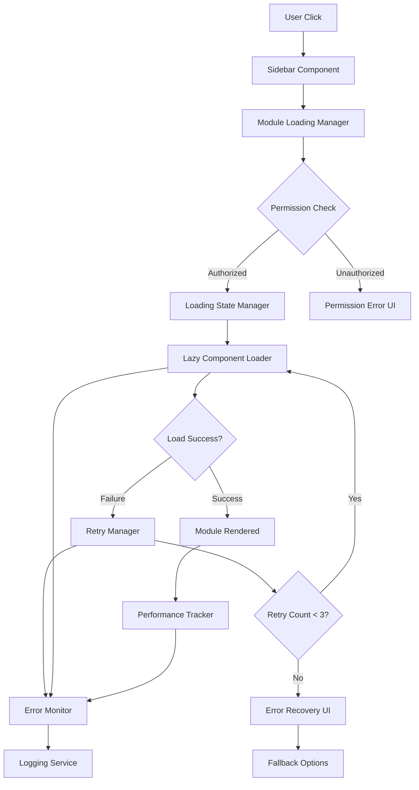
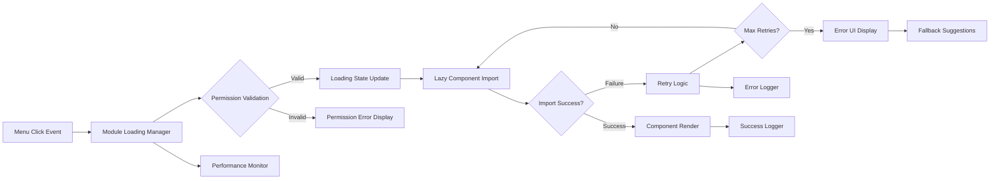
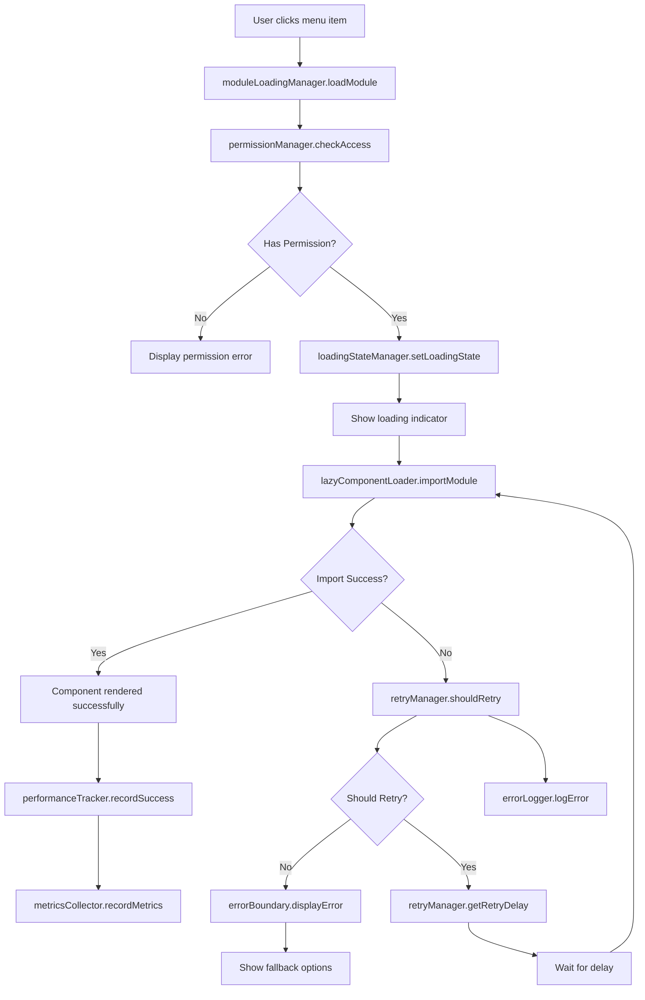
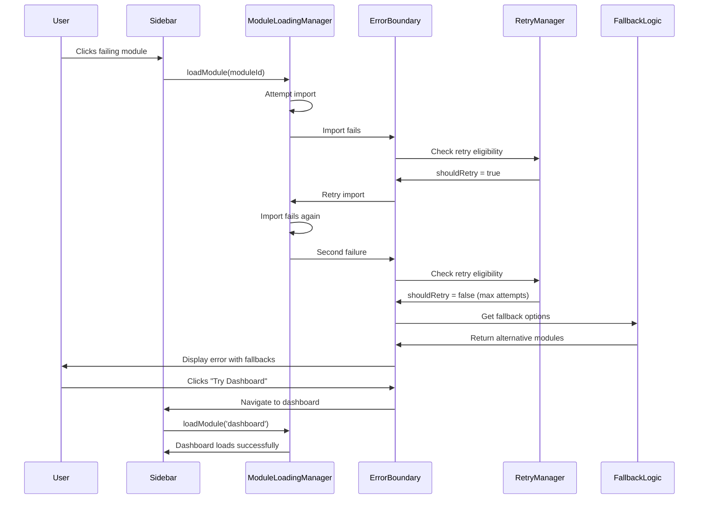
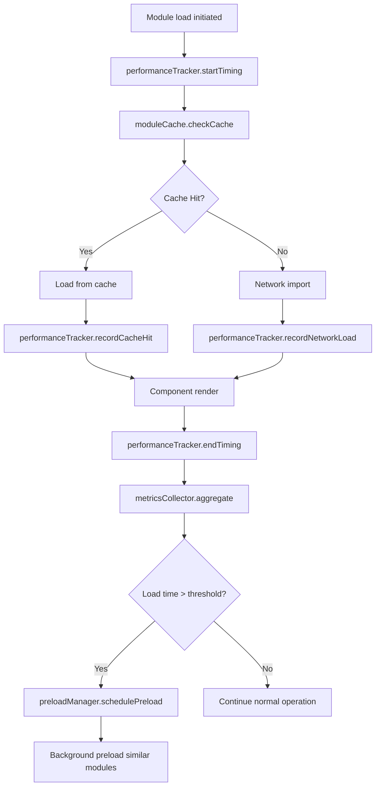

# Design Document: Sidebar Module Loading Fix

## Overview

This design document addresses critical module loading failures in the sidebar navigation system of the React-based business management application. The system currently experiences failures when loading specific business modules (expenses, operations, BIR forms, payroll, cloud backup) due to inadequate error handling, loading state management, and lack of retry mechanisms in the lazy loading implementation.

The solution enhances the existing React 18.3.1 + TypeScript + Vite architecture with comprehensive error recovery, robust loading state management, performance optimization, and detailed monitoring capabilities.

## Architecture Design

### System Architecture Diagram



### Data Flow Diagram



## Component Design

### ModuleLoadingManager

**Responsibilities:**
- Orchestrate the module loading process
- Manage loading states and error handling
- Coordinate retry attempts
- Track loading performance metrics

**Interfaces:**
```typescript
interface ModuleLoadingManager {
  loadModule(moduleId: string): Promise<React.ComponentType>;
  retryModule(moduleId: string): Promise<React.ComponentType>;
  getLoadingState(moduleId: string): LoadingState;
  clearModuleCache(moduleId: string): void;
  preloadModule(moduleId: string): Promise<void>;
}

interface LoadingState {
  status: 'idle' | 'loading' | 'success' | 'error' | 'retrying';
  error?: ModuleLoadingError;
  retryCount: number;
  startTime?: number;
  endTime?: number;
}
```

**Dependencies:**
- LazyComponentRegistry
- RetryManager
- ErrorLogger
- PerformanceTracker

### Enhanced ErrorBoundary

**Responsibilities:**
- Catch and handle module loading errors
- Provide user-friendly error messages
- Offer retry and fallback options
- Log detailed error information

**Interfaces:**
```typescript
interface ModuleErrorBoundaryProps {
  moduleId: string;
  fallbackComponent?: React.ComponentType;
  onError?: (error: ModuleLoadingError) => void;
  maxRetries?: number;
  children: React.ReactNode;
}

interface ModuleLoadingError {
  moduleId: string;
  errorType: 'import_failed' | 'permission_denied' | 'timeout' | 'network_error';
  message: string;
  stack?: string;
  timestamp: number;
  userRole?: string;
  retryCount: number;
}
```

### RetryManager

**Responsibilities:**
- Implement exponential backoff retry logic
- Track retry attempts and success rates
- Prevent excessive retry storms
- Coordinate with caching mechanisms

**Interfaces:**
```typescript
interface RetryManager {
  shouldRetry(moduleId: string, error: Error): boolean;
  getRetryDelay(attemptNumber: number): number;
  incrementRetryCount(moduleId: string): void;
  resetRetryCount(moduleId: string): void;
  getRetryHistory(moduleId: string): RetryAttempt[];
}

interface RetryAttempt {
  timestamp: number;
  attempt: number;
  success: boolean;
  error?: string;
  delay: number;
}
```

### LoadingStateManager

**Responsibilities:**
- Manage loading indicators and user feedback
- Coordinate loading states across components
- Handle loading timeouts and slow connections
- Provide progress indication

**Interfaces:**
```typescript
interface LoadingStateManager {
  setLoadingState(moduleId: string, state: LoadingState): void;
  showLoadingIndicator(moduleId: string, message?: string): void;
  hideLoadingIndicator(moduleId: string): void;
  updateProgress(moduleId: string, progress: number): void;
  isModuleLoading(moduleId: string): boolean;
}

interface LoadingIndicatorProps {
  moduleId: string;
  message?: string;
  showProgress?: boolean;
  timeout?: number;
  onTimeout?: () => void;
}
```

## Data Model

### Core Data Structure Definitions

```typescript
// Module loading configuration
interface ModuleConfig {
  id: string;
  displayName: string;
  componentPath: string;
  requiredPermissions: string[];
  requiredRole?: UserRole;
  timeout: number;
  retryConfig: RetryConfig;
  fallbackModules: string[];
  preloadPriority: 'high' | 'medium' | 'low';
}

// Retry configuration
interface RetryConfig {
  maxAttempts: number;
  baseDelay: number;
  maxDelay: number;
  backoffFactor: number;
  resetAfter: number; // Reset retry count after this many ms
}

// Performance metrics
interface ModulePerformanceMetrics {
  moduleId: string;
  loadTime: number;
  retryCount: number;
  cacheHit: boolean;
  networkCondition: 'fast' | 'slow' | 'offline';
  timestamp: number;
  userRole: string;
  success: boolean;
}

// Error tracking
interface ModuleErrorLog {
  errorId: string;
  moduleId: string;
  errorType: ModuleLoadingErrorType;
  message: string;
  stack?: string;
  userContext: UserContext;
  systemContext: SystemContext;
  timestamp: number;
  resolved: boolean;
  resolution?: string;
}

interface UserContext {
  userId: string;
  role: UserRole;
  sessionId: string;
  previousModule?: string;
}

interface SystemContext {
  userAgent: string;
  networkType?: string;
  availableMemory?: number;
  connectionType?: string;
  url: string;
}
```

### Data Model Diagram

```mermaid
classDiagram
    class ModuleConfig {
        +string id
        +string displayName
        +string componentPath
        +string[] requiredPermissions
        +UserRole requiredRole
        +number timeout
        +RetryConfig retryConfig
        +string[] fallbackModules
    }
    
    class LoadingState {
        +LoadingStatus status
        +ModuleLoadingError error
        +number retryCount
        +number startTime
        +number endTime
    }
    
    class ModuleLoadingError {
        +string moduleId
        +ErrorType errorType
        +string message
        +string stack
        +number timestamp
        +UserRole userRole
        +number retryCount
    }
    
    class PerformanceMetrics {
        +string moduleId
        +number loadTime
        +number retryCount
        +boolean cacheHit
        +string networkCondition
        +number timestamp
        +boolean success
    }
    
    ModuleConfig ||--|| RetryConfig
    LoadingState ||--o| ModuleLoadingError
    ModuleLoadingError ||--|| UserContext
    ModuleLoadingError ||--|| SystemContext
```

## Business Process

### Process 1: Module Loading Workflow



### Process 2: Error Recovery and Fallback



### Process 3: Performance Monitoring and Optimization



## Error Handling Strategy

### Comprehensive Error Recovery System

**Error Classification:**
1. **Import Errors**: Failed dynamic imports due to network or build issues
2. **Permission Errors**: User lacks required role or module permissions
3. **Timeout Errors**: Module takes too long to load
4. **Runtime Errors**: Component crashes during initialization
5. **Network Errors**: Connection issues preventing module loading

**Recovery Mechanisms:**
1. **Automatic Retry**: Exponential backoff for transient failures
2. **Cache Invalidation**: Clear corrupted cached modules
3. **Fallback Components**: Load alternative modules with similar functionality
4. **Graceful Degradation**: Provide limited functionality when full module fails
5. **User-Initiated Recovery**: Manual retry and alternative navigation options

**Error UI Components:**
```typescript
interface ErrorRecoveryUI {
  ModuleLoadingError: React.ComponentType<{
    error: ModuleLoadingError;
    onRetry: () => void;
    onFallback: (moduleId: string) => void;
    fallbackOptions: FallbackOption[];
  }>;
  
  PermissionDeniedError: React.ComponentType<{
    requiredRole: string;
    currentRole: string;
    contactSupport: () => void;
  }>;
  
  NetworkErrorUI: React.ComponentType<{
    isOffline: boolean;
    onReconnect: () => void;
    offlineCapabilities: string[];
  }>;
}
```

## Loading State Management

### Enhanced Loading Indicators

**Loading State Hierarchy:**
1. **Immediate Feedback**: Visual response within 100ms of click
2. **Progress Indication**: Loading spinner and module name
3. **Extended Loading**: Additional context after 2 seconds
4. **Slow Connection**: Network status after 5 seconds
5. **Timeout Warning**: Alternative options after 10 seconds

**Loading State Components:**
```typescript
interface LoadingComponents {
  QuickLoadingSpinner: React.ComponentType<{
    moduleName: string;
    showProgress?: boolean;
  }>;
  
  ExtendedLoadingState: React.ComponentType<{
    moduleName: string;
    progress: number;
    estimatedTime?: number;
    onCancel: () => void;
  }>;
  
  SlowConnectionIndicator: React.ComponentType<{
    networkType: string;
    alternativeOptions: string[];
    onFallback: (option: string) => void;
  }>;
}
```

## Performance Optimization

### Caching and Preloading Strategy

**Module Caching System:**
```typescript
interface ModuleCacheManager {
  // Cache successful imports for session
  cacheModule(moduleId: string, component: React.ComponentType): void;
  
  // Retrieve cached component
  getCachedModule(moduleId: string): React.ComponentType | null;
  
  // Intelligent cache invalidation
  invalidateModule(moduleId: string): void;
  
  // Preload high-priority modules
  preloadModules(moduleIds: string[]): Promise<void>;
  
  // Cache warming for user role
  warmCacheForRole(role: UserRole): Promise<void>;
}
```

**Performance Optimizations:**
1. **Smart Preloading**: Preload modules based on user role and usage patterns
2. **Module Bundling**: Bundle related modules for faster loading
3. **Network-Aware Loading**: Adjust loading strategy based on connection speed
4. **Memory Management**: Lazy unload unused modules to prevent memory leaks
5. **Critical Path Optimization**: Prioritize loading of essential modules

## Monitoring and Diagnostics

### Comprehensive Logging System

**Error Logging Infrastructure:**
```typescript
interface ModuleLoadingLogger {
  logLoadAttempt(moduleId: string, context: LoadingContext): void;
  logLoadSuccess(moduleId: string, metrics: PerformanceMetrics): void;
  logLoadFailure(moduleId: string, error: ModuleLoadingError): void;
  logRetryAttempt(moduleId: string, attempt: number): void;
  logFallbackActivation(moduleId: string, fallback: string): void;
  generateErrorReport(timeframe: TimeRange): ErrorReport;
  exportDiagnostics(): DiagnosticData;
}

interface DiagnosticData {
  moduleLoadStats: ModuleLoadStatistics[];
  errorPatterns: ErrorPattern[];
  userJourneyAnalysis: UserJourney[];
  systemHealthMetrics: SystemHealth;
  recommendedActions: RecommendedAction[];
}
```

**Real-time Monitoring Dashboard:**
```typescript
interface MonitoringDashboard {
  ModuleHealthIndicator: React.ComponentType<{
    modules: ModuleConfig[];
    healthStatus: Record<string, HealthStatus>;
  }>;
  
  LoadingPerformanceChart: React.ComponentType<{
    timeframe: TimeRange;
    metrics: PerformanceMetrics[];
  }>;
  
  ErrorTrendAnalysis: React.ComponentType<{
    errors: ModuleLoadingError[];
    groupBy: 'module' | 'user' | 'time';
  }>;
}
```

## Implementation Approach

### Phase 1: Core Infrastructure (Week 1)
1. **Enhanced Error Boundary**: Upgrade existing ErrorBoundary with module-specific handling
2. **Module Loading Manager**: Create centralized loading orchestration
3. **Retry Manager**: Implement exponential backoff retry logic
4. **Loading State Manager**: Enhanced loading indicators and user feedback

### Phase 2: Error Recovery and Fallbacks (Week 2)
1. **Fallback System**: Implement alternative module suggestions
2. **Permission Error Handling**: Enhanced permission denied UI
3. **Network Error Recovery**: Handle offline and slow connection scenarios
4. **User Recovery Actions**: Manual retry and navigation options

### Phase 3: Performance and Monitoring (Week 3)
1. **Module Caching**: Implement intelligent caching system
2. **Preloading Strategy**: Smart preloading based on user patterns
3. **Performance Monitoring**: Real-time loading metrics collection
4. **Diagnostic Tools**: Admin dashboard for monitoring module health

### Phase 4: Testing and Optimization (Week 4)
1. **Comprehensive Testing**: Unit, integration, and E2E tests
2. **Performance Optimization**: Bundle analysis and optimization
3. **User Acceptance Testing**: Validate with actual business users
4. **Documentation and Training**: Complete documentation and user guides

### Risk Mitigation

**Implementation Risks:**
1. **Breaking Changes**: Comprehensive testing to prevent regression
2. **Performance Impact**: Careful monitoring of loading performance
3. **Complex Error States**: Thorough error scenario testing
4. **User Experience**: Continuous feedback during development

**Rollback Strategy:**
1. **Feature Flags**: Gradual rollout with ability to disable
2. **A/B Testing**: Compare new vs old loading system
3. **Quick Rollback**: Ability to revert to previous system
4. **Monitoring Alerts**: Automated detection of performance degradation

This design provides a comprehensive solution to the sidebar module loading issues while maintaining the existing architecture and enhancing the overall user experience with robust error handling, performance optimization, and detailed monitoring capabilities.