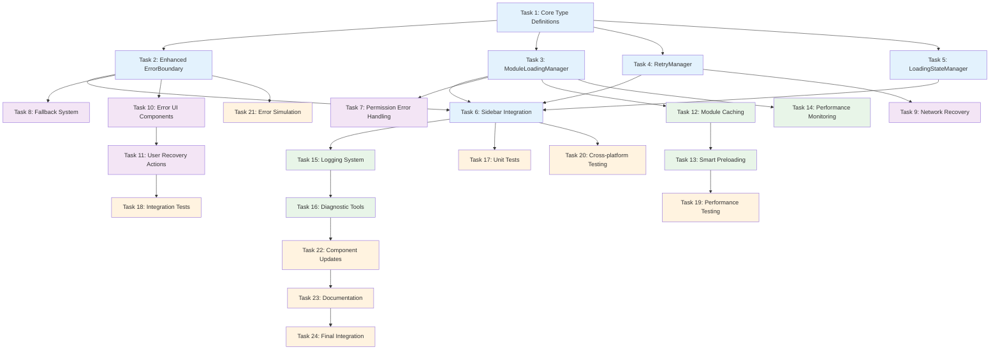

# Implementation Plan: Sidebar Module Loading Fix

## Overview

This implementation plan addresses critical module loading failures in the sidebar navigation system. The plan follows a 4-phase approach to implement comprehensive error handling, retry mechanisms, performance optimization, and monitoring for the React-based business management application.

The solution enhances the existing React 18.3.1 + TypeScript + Vite + Zustand architecture while maintaining backward compatibility and improving user experience.

## Implementation Tasks

### Phase 1: Core Infrastructure

- [ ] 1. Create core type definitions and interfaces
  - Define ModuleLoadingError, LoadingState, ModuleConfig, and related TypeScript interfaces
  - Create comprehensive error classification system for different failure modes
  - Implement performance metrics and monitoring data structures
  - _Requirements: 1.7, 2.7, 7.1-7.7_

- [ ] 2. Enhance ErrorBoundary component for module-specific handling
  - Extend existing ErrorBoundary with module loading error detection
  - Add retry functionality with exponential backoff logic
  - Implement fallback UI components for different error types
  - Create permission-aware error handling for unauthorized access
  - _Requirements: 2.1-2.7, 5.1-5.7_

- [ ] 3. Create ModuleLoadingManager service
  - Implement centralized module loading orchestration
  - Add module loading state tracking and coordination
  - Create integration with existing lazyComponents.ts system
  - Implement timeout handling and slow connection detection
  - _Requirements: 1.1-1.7, 4.1-4.7_

- [ ] 4. Implement RetryManager with intelligent retry logic
  - Create exponential backoff retry mechanism with configurable limits
  - Add retry attempt tracking and success rate monitoring
  - Implement retry cooldown periods to prevent retry storms
  - Create retry eligibility validation based on error types
  - _Requirements: 1.6, 2.4, 2.6_

- [ ] 5. Create LoadingStateManager for enhanced user feedback
  - Implement immediate loading indicators (within 100ms response)
  - Add progress indication and estimated loading times
  - Create slow connection detection and user notification system
  - Implement loading timeout warnings and alternative options
  - _Requirements: 3.1-3.7, 4.6_

- [ ] 6. Integrate with existing Sidebar component
  - Update Sidebar.tsx to use ModuleLoadingManager
  - Add loading state visualization to menu items
  - Implement click debouncing to prevent multiple rapid requests
  - Create active module state management during loading
  - _Requirements: 3.1, 3.5, 3.7, 6.1-6.7_

### Phase 2: Error Recovery and Fallbacks

- [x] 7. Create permission-aware error handling system
  - Implement permission validation before module loading attempts
  - Create role-specific error messages with clear requirements
  - Add permission change detection during user sessions
  - Create "request access" functionality with admin contact options
  - _Requirements: 5.1-5.7_

- [x] 8. Implement fallback module suggestion system
  - Create intelligent fallback recommendations for failed modules
  - Map related modules (e.g., ExpenseTracking → Accounting)
  - Implement system status indicator showing available modules
  - Create graceful degradation to Dashboard when multiple failures occur
  - _Requirements: 8.1-8.7_

- [x] 9. Create network-aware recovery mechanisms
  - Implement offline detection and appropriate user messaging
  - Add slow connection handling with alternative loading strategies
  - Create network condition monitoring and adaptive loading
  - Implement retry strategies based on network status
  - _Requirements: 4.6, 8.6_

- [x] 10. Build comprehensive error UI components
  - Create ModuleLoadingError component with retry and fallback options
  - Implement PermissionDeniedError with role requirement display
  - Build NetworkErrorUI for offline/slow connection scenarios
  - Add user-friendly error messages with actionable recovery steps
  - _Requirements: 2.1-2.3, 5.7, 8.7_

- [x] 11. Implement user recovery actions
  - Add manual retry buttons with loading state feedback
  - Create "Go to Dashboard" fallback navigation option
  - Implement alternative module navigation from error screens
  - Add support contact integration for persistent failures
  - _Requirements: 2.2-2.4, 8.7_

### Phase 3: Performance and Monitoring

- [ ] 12. Create module caching system
  - Implement session-based module caching for improved performance
  - Add intelligent cache invalidation for corrupted modules
  - Create cache warming for user roles during login
  - Implement memory management to prevent cache-related memory leaks
  - _Requirements: 4.3, 4.5_

- [ ] 13. Implement smart preloading based on user patterns
  - Create role-based module preloading during application startup
  - Add usage pattern analysis for intelligent preloading
  - Implement high-priority module identification and background loading
  - Create network-aware preloading that adapts to connection speed
  - _Requirements: 4.2, 4.4_

- [ ] 14. Build performance monitoring and metrics collection
  - Create real-time loading performance tracking
  - Implement detailed timing metrics for each loading phase
  - Add performance threshold monitoring with alert system
  - Create network condition detection and performance correlation
  - _Requirements: 4.1-4.6, 7.1-7.2_

- [ ] 15. Create comprehensive logging system
  - Implement detailed error logging with user and system context
  - Add loading attempt tracking with success/failure metrics
  - Create performance metrics aggregation and reporting
  - Implement development mode detailed console logging
  - _Requirements: 7.1-7.7_

- [ ] 16. Build diagnostic tools and monitoring dashboard
  - Create admin-accessible module health monitoring interface
  - Implement error pattern analysis and trending reports
  - Add system performance dashboards with real-time metrics
  - Create diagnostic data export functionality for troubleshooting
  - _Requirements: 7.4-7.7_

### Phase 4: Testing and Optimization

- [ ] 17. Create comprehensive unit tests
  - Write unit tests for ModuleLoadingManager with all error scenarios
  - Test RetryManager exponential backoff and retry logic
  - Create ErrorBoundary tests covering all error types and recovery paths
  - Test LoadingStateManager timing and state transitions
  - _Requirements: All requirements verification through automated testing_

- [ ] 18. Implement integration tests
  - Create end-to-end testing for complete module loading workflows
  - Test permission-based access control integration
  - Validate error recovery and fallback mechanisms
  - Test cross-platform compatibility (desktop/mobile navigation)
  - _Requirements: 6.1-6.7, integration testing for all workflows_

- [ ] 19. Add performance testing and optimization
  - Create performance benchmarks for loading time requirements
  - Test module loading under various network conditions
  - Validate caching effectiveness and memory usage
  - Optimize bundle sizes and loading strategies
  - _Requirements: 4.1-4.7_

- [ ] 20. Implement cross-platform compatibility testing
  - Test desktop Sidebar component integration
  - Validate mobile BottomNavigation component compatibility  
  - Test touch interface responsiveness and keyboard navigation
  - Verify consistent behavior across device types
  - _Requirements: 6.1-6.7_

- [ ] 21. Create error simulation and testing utilities
  - Build development tools to simulate different error conditions
  - Create network condition simulation for testing slow/offline scenarios
  - Implement permission testing utilities for different user roles
  - Add stress testing capabilities for retry and recovery mechanisms
  - _Requirements: Support comprehensive testing of all error scenarios_

- [ ] 22. Update existing components integration
  - Update lazyComponents.ts to integrate with new loading system
  - Modify existing module components to work with enhanced error handling
  - Update BottomNavigation.tsx for mobile compatibility
  - Ensure Header.tsx module switching works with new loading states
  - _Requirements: Maintain backward compatibility with existing architecture_

- [ ] 23. Create documentation and user guides
  - Write technical documentation for the new loading system architecture
  - Create troubleshooting guides for common loading issues
  - Document configuration options for administrators
  - Create user-facing help documentation for error recovery
  - _Requirements: Support user education and system maintenance_

- [ ] 24. Final integration and deployment preparation
  - Integrate all components into the main application
  - Create feature flags for gradual rollout capability
  - Implement rollback mechanisms and monitoring alerts
  - Conduct final user acceptance testing with business users
  - _Requirements: Ensure production readiness and safe deployment_

## Task Dependencies

The following diagram shows the critical path and parallel execution opportunities:

**Legend:**
- **Blue (Phase 1)**: Core Infrastructure - Foundation components
- **Purple (Phase 2)**: Error Recovery - User-facing error handling
- **Green (Phase 3)**: Performance & Monitoring - Optimization features  
- **Orange (Phase 4)**: Testing & Integration - Quality assurance and deployment

**Parallel Execution Opportunities:**
- Tasks 2-5 can be developed in parallel after Task 1 completion
- Tasks 7-11 can be developed in parallel during Phase 2
- Tasks 12-16 can be developed in parallel during Phase 3
- Tasks 17-21 can be executed in parallel during testing phase

**Critical Path:** T1 → T3 → T6 → T15 → T22 → T24 (defines minimum project timeline)