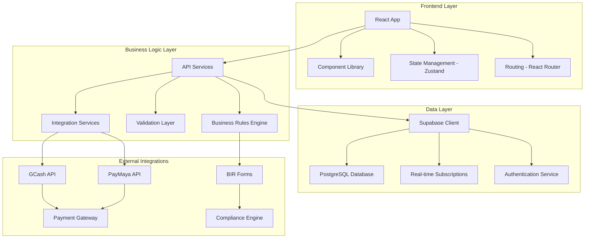

# Design Document

## Overview

This design document outlines the architecture and implementation approach for completing the Filipino Business Management System (FBMS). The system will provide a comprehensive, integrated business management solution with Philippine-specific compliance features, payment integrations, and role-based access control.

## Architecture

### System Architecture



### Component Architecture

The system follows a modular, feature-based architecture with the following key components:

1. **Core Application Shell**: Main app component with routing and layout
2. **Feature Modules**: Self-contained modules for each business function
3. **Shared Components**: Reusable UI components and utilities
4. **State Management**: Centralized state with domain-specific stores
5. **API Layer**: Service layer for data operations and external integrations

## Components and Interfaces

### Core Application Components

#### App Shell
- **App.tsx**: Main application component with routing and layout
- **Header.tsx**: Top navigation with user info and notifications
- **Sidebar.tsx**: Left navigation menu with role-based filtering
- **BottomNavigation.tsx**: Mobile navigation for key functions

#### Authentication System
- **AuthPage.tsx**: Unified login/register interface
- **ProtectedRoute.tsx**: Route protection based on authentication
- **PermissionGuard.tsx**: Component-level access control based on roles

#### Enhanced Version System
- **VersionSelector.tsx**: Toggle between standard and enhanced features
- **EnhancedVersionMenu.tsx**: Floating menu for feature overview
- **FeatureToggle.tsx**: Individual feature toggle components

### Business Module Components

#### Point of Sale (POS)
- **POSSystem.tsx**: Standard POS interface
- **EnhancedPOSSystem.tsx**: Advanced POS with barcode scanning
- **ProductGrid.tsx**: Product selection interface
- **Cart.tsx**: Shopping cart with calculations
- **PaymentModal.tsx**: Payment processing with multiple methods
- **CustomerSelector.tsx**: Customer lookup and selection

#### Inventory Management
- **InventoryManagement.tsx**: Standard inventory interface
- **EnhancedInventoryManagement.tsx**: Advanced inventory with multi-location
- **ProductForm.tsx**: Product creation and editing
- **ProductList.tsx**: Product catalog with search and filters
- **StockMovement.tsx**: Inventory movement tracking
- **TransferSlip.tsx**: Inter-location transfer management

#### Customer Management
- **CustomerManagement.tsx**: Customer database and CRM
- **CustomerForm.tsx**: Customer creation and editing
- **CustomerProfile.tsx**: Detailed customer view with history
- **LoyaltyPrograms.tsx**: Customer loyalty program management
- **MarketingCampaigns.tsx**: Campaign creation and tracking

#### Financial Management
- **AccountingManagement.tsx**: Standard accounting interface
- **EnhancedAccountingManagement.tsx**: Advanced accounting with analytics
- **ChartOfAccounts.tsx**: Account structure management
- **JournalEntries.tsx**: Transaction recording
- **BIRForms.tsx**: Philippine tax form generation

### Integration Components

#### Payment Integration
- **GCashIntegration.tsx**: GCash payment processing
- **PayMayaIntegration.tsx**: PayMaya payment processing
- **PaymentVerification.tsx**: Payment status verification
- **QRCodeGenerator.tsx**: QR code generation for payments

#### Receipt System
- **ElectronicReceipts.tsx**: Digital receipt generation
- **ReceiptTemplate.tsx**: BIR-compliant receipt formatting
- **ReceiptDelivery.tsx**: Email/SMS/QR delivery system

## Data Models

### Core Business Entities

#### User Management
```typescript
interface User {
  id: string;
  email: string;
  firstName: string;
  lastName: string;
  role: 'admin' | 'manager' | 'cashier' | 'accountant';
  department?: string;
  isActive: boolean;
  createdAt: Date;
  lastLogin?: Date;
}

interface UserSession {
  user: User;
  token: string;
  expiresAt: Date;
  permissions: string[];
}
```

#### Product and Inventory
```typescript
interface Product {
  id: string;
  sku: string;
  name: string;
  description?: string;
  category: string;
  price: number;
  cost: number;
  stockQuantity: number;
  reorderPoint: number;
  barcode?: string;
  isActive: boolean;
  locations: ProductLocation[];
}

interface ProductLocation {
  locationId: string;
  quantity: number;
  reservedQuantity: number;
  lastUpdated: Date;
}

interface StockMovement {
  id: string;
  productId: string;
  type: 'in' | 'out' | 'transfer' | 'adjustment';
  quantity: number;
  fromLocation?: string;
  toLocation?: string;
  reference: string;
  notes?: string;
  createdAt: Date;
}
```

#### Sales and Transactions
```typescript
interface Sale {
  id: string;
  saleNumber: string;
  customerId?: string;
  items: SaleItem[];
  subtotal: number;
  tax: number;
  discount: number;
  total: number;
  paymentMethod: PaymentMethod;
  status: 'pending' | 'completed' | 'cancelled';
  createdAt: Date;
  processedBy: string;
}

interface SaleItem {
  productId: string;
  quantity: number;
  unitPrice: number;
  discount: number;
  total: number;
}

interface PaymentMethod {
  type: 'cash' | 'gcash' | 'paymaya' | 'bank_transfer';
  amount: number;
  reference?: string;
  status: 'pending' | 'verified' | 'failed';
}
```

#### Customer Management
```typescript
interface Customer {
  id: string;
  customerNumber: string;
  firstName: string;
  lastName: string;
  email?: string;
  phone?: string;
  address?: Address;
  creditLimit: number;
  currentBalance: number;
  loyaltyPoints: number;
  loyaltyTier: 'bronze' | 'silver' | 'gold' | 'platinum';
  isActive: boolean;
  createdAt: Date;
}

interface LoyaltyProgram {
  id: string;
  name: string;
  type: 'points' | 'cashback' | 'tier';
  rules: LoyaltyRule[];
  isActive: boolean;
}
```

#### Financial and Accounting
```typescript
interface Account {
  id: string;
  code: string;
  name: string;
  type: 'asset' | 'liability' | 'equity' | 'revenue' | 'expense';
  parentId?: string;
  balance: number;
  isActive: boolean;
}

interface JournalEntry {
  id: string;
  entryNumber: string;
  date: Date;
  description: string;
  reference?: string;
  lines: JournalLine[];
  status: 'draft' | 'posted';
  createdBy: string;
}

interface JournalLine {
  accountId: string;
  debit: number;
  credit: number;
  description?: string;
}
```

## Error Handling

### Error Classification
1. **Validation Errors**: Input validation failures with user-friendly messages
2. **Business Logic Errors**: Rule violations with contextual explanations
3. **Integration Errors**: External service failures with retry mechanisms
4. **System Errors**: Technical failures with fallback options

### Error Handling Strategy
```typescript
interface ErrorResponse {
  code: string;
  message: string;
  details?: any;
  timestamp: Date;
  requestId: string;
}

class ErrorHandler {
  static handleValidationError(error: ValidationError): UserFriendlyError;
  static handleBusinessError(error: BusinessError): UserFriendlyError;
  static handleIntegrationError(error: IntegrationError): UserFriendlyError;
  static handleSystemError(error: SystemError): UserFriendlyError;
}
```

### Error Recovery Mechanisms
- **Automatic Retry**: For transient network failures
- **Graceful Degradation**: Fallback to basic functionality when enhanced features fail
- **Offline Mode**: Local storage backup for critical operations
- **User Notification**: Clear error messages with suggested actions

## Testing Strategy

### Testing Pyramid

#### Unit Tests (70% of tests)
- **Business Logic**: Core calculations and validations
- **Utilities**: Helper functions and formatters
- **State Management**: Store actions and reducers
- **API Services**: Data transformation and error handling

#### Integration Tests (20% of tests)
- **Component Integration**: Module interactions and data flow
- **API Integration**: External service connections
- **Database Operations**: Data persistence and retrieval
- **Authentication Flow**: Login, logout, and session management

#### End-to-End Tests (10% of tests)
- **Complete Workflows**: Full business process testing
- **User Journeys**: Critical path testing for each role
- **Cross-Browser Testing**: Compatibility across browsers
- **Mobile Testing**: Responsive design and touch interactions

### Testing Tools and Framework
- **Unit Testing**: Vitest with React Testing Library
- **Integration Testing**: Custom test utilities with mock services
- **E2E Testing**: Playwright for browser automation
- **Performance Testing**: Lighthouse CI for performance metrics

### Test Data Management
- **Fixtures**: Predefined test data for consistent testing
- **Factories**: Dynamic test data generation
- **Mocks**: External service mocking for isolated testing
- **Cleanup**: Automated test data cleanup after test runs

### Continuous Testing
- **Pre-commit Hooks**: Run unit tests before commits
- **CI/CD Pipeline**: Automated testing on pull requests
- **Regression Testing**: Full test suite on releases
- **Performance Monitoring**: Continuous performance tracking

## Security Considerations

### Authentication and Authorization
- **JWT Tokens**: Secure token-based authentication
- **Role-Based Access**: Granular permission system
- **Session Management**: Secure session handling with expiration
- **Password Security**: Strong password requirements and hashing

### Data Protection
- **Input Validation**: Comprehensive input sanitization
- **SQL Injection Prevention**: Parameterized queries and ORM usage
- **XSS Protection**: Content Security Policy and output encoding
- **CSRF Protection**: Token-based CSRF prevention

### API Security
- **Rate Limiting**: Request throttling to prevent abuse
- **CORS Configuration**: Proper cross-origin resource sharing
- **HTTPS Enforcement**: Secure communication channels
- **API Key Management**: Secure storage and rotation of API keys

### Compliance and Auditing
- **Audit Logging**: Comprehensive activity logging
- **Data Retention**: Compliant data retention policies
- **Privacy Protection**: GDPR-compliant data handling
- **BIR Compliance**: Philippine tax regulation adherence