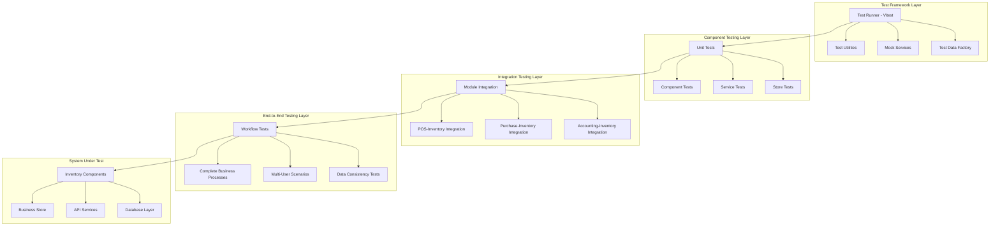

# Design Document

## Overview

This design document outlines the comprehensive testing strategy for the Filipino Business Management System (FBMS) inventory management system. The testing framework will validate all inventory operations, data integrity, module integrations, and business logic to ensure the system functions correctly under various scenarios and edge cases.

## Architecture

### Testing Architecture



### Test Data Architecture

The testing system will use a structured approach to test data management:

1. **Test Data Factory**: Generates consistent, realistic test data
2. **Mock Services**: Simulates external dependencies and API calls
3. **Test Database**: Isolated test environment with controlled data
4. **Cleanup Utilities**: Ensures test isolation and data consistency

## Components and Interfaces

### Core Testing Components

#### Test Data Factory
```typescript
interface TestDataFactory {
  createProduct(overrides?: Partial<Product>): Product;
  createCategory(overrides?: Partial<Category>): Category;
  createSale(overrides?: Partial<Sale>): Sale;
  createPurchaseOrder(overrides?: Partial<PurchaseOrder>): PurchaseOrder;
  createStockMovement(overrides?: Partial<StockMovement>): StockMovement;
  createInventoryLocation(overrides?: Partial<InventoryLocation>): InventoryLocation;
  createBulkProducts(count: number): Product[];
  createRealisticInventoryData(): InventoryTestData;
}
```

#### Test Utilities
```typescript
interface TestUtilities {
  setupTestEnvironment(): Promise<void>;
  cleanupTestData(): Promise<void>;
  waitForAsyncOperations(): Promise<void>;
  mockApiResponses(responses: MockResponse[]): void;
  simulateUserInteraction(action: UserAction): Promise<void>;
  validateDataConsistency(): Promise<ValidationResult>;
}
```

#### Mock Services
```typescript
interface MockInventoryService {
  mockProductOperations(): void;
  mockStockMovements(): void;
  mockLocationTransfers(): void;
  mockIntegrationCalls(): void;
  simulateNetworkErrors(): void;
  simulateSlowResponses(): void;
}
```

### Testing Components by Category

#### Unit Test Components

**Product Management Tests**
- `ProductForm.test.tsx`: Form validation and submission
- `ProductList.test.tsx`: Product display and filtering
- `ProductCRUD.test.ts`: Create, read, update, delete operations
- `ProductValidation.test.ts`: Business rule validation

**Stock Management Tests**
- `StockMovement.test.ts`: Stock adjustment calculations
- `StockTracking.test.ts`: Movement history and audit trails
- `StockAlerts.test.ts`: Low stock and reorder point alerts
- `StockValuation.test.ts`: Inventory valuation methods

**Multi-Location Tests**
- `LocationManagement.test.ts`: Location-specific operations
- `StockTransfer.test.ts`: Inter-location transfers
- `LocationReporting.test.ts`: Location-based reporting

#### Integration Test Components

**POS Integration Tests**
- `POSInventorySync.test.ts`: Real-time inventory updates from sales
- `SalesStockReduction.test.ts`: Stock reduction on sale completion
- `ReturnStockIncrease.test.ts`: Stock restoration on returns
- `ConcurrentSales.test.ts`: Multiple simultaneous transactions

**Purchase Integration Tests**
- `PurchaseReceiving.test.ts`: Stock increases from purchase receipts
- `PurchaseMatching.test.ts`: Three-way matching with inventory updates
- `SupplierReturns.test.ts`: Stock adjustments for returned goods
- `CostUpdates.test.ts`: Inventory cost updates from purchases

**Accounting Integration Tests**
- `InventoryJournalEntries.test.ts`: Automatic accounting entries
- `CostOfGoodsSold.test.ts`: COGS calculations and entries
- `InventoryValuation.test.ts`: Periodic inventory valuation
- `AccountReconciliation.test.ts`: Inventory account reconciliation

#### End-to-End Test Components

**Complete Workflow Tests**
- `FullInventoryLifecycle.test.ts`: Product creation to disposal
- `MultiLocationWorkflow.test.ts`: Cross-location operations
- `SeasonalInventoryManagement.test.ts`: Seasonal stock management
- `InventoryAuditProcess.test.ts`: Complete audit workflow

## Data Models

### Test Data Models

#### Test Product Model
```typescript
interface TestProduct extends Product {
  testMetadata: {
    createdForTest: string;
    expectedBehavior: string[];
    validationRules: ValidationRule[];
    integrationPoints: string[];
  };
}
```

#### Test Scenario Model
```typescript
interface TestScenario {
  id: string;
  name: string;
  description: string;
  category: TestCategory;
  prerequisites: Prerequisite[];
  steps: TestStep[];
  expectedResults: ExpectedResult[];
  cleanup: CleanupAction[];
}

type TestCategory = 'unit' | 'integration' | 'e2e' | 'performance' | 'security';
```

#### Test Validation Model
```typescript
interface ValidationResult {
  isValid: boolean;
  errors: ValidationError[];
  warnings: ValidationWarning[];
  dataConsistency: ConsistencyCheck[];
  performanceMetrics: PerformanceMetric[];
}
```

### Inventory Test Data Structure

#### Core Inventory Entities for Testing
```typescript
interface InventoryTestData {
  products: TestProduct[];
  categories: Category[];
  locations: InventoryLocation[];
  stockMovements: StockMovement[];
  transfers: StockTransfer[];
  alerts: StockAlert[];
  valuationHistory: ValuationRecord[];
}
```

#### Test Scenarios Data
```typescript
interface TestScenarioData {
  lowStockScenarios: Product[];
  outOfStockScenarios: Product[];
  expiringProductScenarios: Product[];
  highVolumeTransactionScenarios: Sale[];
  multiLocationScenarios: LocationTestData[];
  integrationScenarios: IntegrationTestData[];
}
```

## Error Handling

### Test Error Management

#### Error Simulation
```typescript
interface ErrorSimulation {
  simulateNetworkFailure(): void;
  simulateDatabaseError(): void;
  simulateValidationError(): void;
  simulateConcurrencyConflict(): void;
  simulateDataCorruption(): void;
}
```

#### Error Recovery Testing
```typescript
interface ErrorRecoveryTest {
  testTransactionRollback(): Promise<TestResult>;
  testDataConsistencyAfterError(): Promise<TestResult>;
  testUserNotificationOnError(): Promise<TestResult>;
  testSystemRecoveryAfterFailure(): Promise<TestResult>;
}
```

### Test Failure Handling

**Failure Categories**
1. **Assertion Failures**: Expected vs actual result mismatches
2. **Integration Failures**: Module communication breakdowns
3. **Data Integrity Failures**: Inconsistent data states
4. **Performance Failures**: Response time or throughput issues
5. **Security Failures**: Access control or data protection issues

**Recovery Strategies**
- Automatic test retry for transient failures
- Detailed logging for failure analysis
- Test environment reset for clean state
- Parallel test execution isolation

## Testing Strategy

### Test Pyramid Implementation

#### Unit Tests (70% of test coverage)

**Product Management Unit Tests**
- Product creation with validation
- Product updates and field validation
- SKU uniqueness enforcement
- Price and cost calculation validation
- Stock quantity validation and constraints

**Stock Movement Unit Tests**
- Stock adjustment calculations
- Movement type validation (in, out, transfer, adjustment)
- Audit trail creation and integrity
- Concurrent stock update handling
- Stock level threshold calculations

**Business Logic Unit Tests**
- Reorder point calculations
- Stock valuation methods (FIFO, LIFO, Average Cost)
- Low stock alert generation
- Expiry date tracking and warnings
- Multi-location stock aggregation

#### Integration Tests (20% of test coverage)

**POS-Inventory Integration**
- Real-time stock updates during sales
- Stock reservation during checkout process
- Stock release on transaction cancellation
- Batch processing of multiple sales
- Concurrent user transaction handling

**Purchase-Inventory Integration**
- Stock increases from purchase receipts
- Partial receipt handling and tracking
- Purchase order completion status updates
- Supplier return processing
- Cost basis updates from purchases

**Accounting-Inventory Integration**
- Automatic journal entry creation
- Cost of goods sold calculations
- Inventory asset account updates
- Period-end inventory adjustments
- Financial statement inventory reporting

#### End-to-End Tests (10% of test coverage)

**Complete Business Workflows**
- New product introduction to first sale
- Purchase order to stock receipt to sale
- Multi-location transfer and sale process
- Inventory audit and adjustment workflow
- Seasonal inventory management cycle

**Multi-User Scenarios**
- Concurrent inventory operations by multiple users
- Role-based access control validation
- Data consistency under concurrent access
- Real-time updates across user sessions
- Conflict resolution in simultaneous operations

### Performance Testing Strategy

#### Load Testing Scenarios
```typescript
interface LoadTestScenario {
  name: string;
  userCount: number;
  duration: number;
  operations: InventoryOperation[];
  expectedResponseTime: number;
  expectedThroughput: number;
}
```

**Performance Test Cases**
1. **High-Volume Product Management**: 10,000+ products with concurrent access
2. **Rapid Stock Movements**: 1,000+ transactions per minute
3. **Large Dataset Reporting**: Reports with 50,000+ records
4. **Multi-Location Synchronization**: Real-time updates across 10+ locations
5. **Concurrent User Operations**: 100+ simultaneous users

#### Scalability Testing
- Database query performance with large datasets
- Memory usage under high load conditions
- Response time degradation analysis
- System resource utilization monitoring
- Breaking point identification and documentation

### Security Testing Strategy

#### Access Control Testing
```typescript
interface SecurityTestSuite {
  testRoleBasedAccess(): Promise<TestResult>;
  testDataIsolation(): Promise<TestResult>;
  testInputValidation(): Promise<TestResult>;
  testAuditTrailIntegrity(): Promise<TestResult>;
  testDataEncryption(): Promise<TestResult>;
}
```

**Security Test Scenarios**
1. **Unauthorized Access Prevention**: Role-based access enforcement
2. **Data Tampering Protection**: Input validation and sanitization
3. **Audit Trail Integrity**: Immutable movement history
4. **Sensitive Data Protection**: Cost and pricing information security
5. **API Security**: Inventory API endpoint protection

## Test Implementation Plan

### Phase 1: Unit Test Foundation
- Set up test framework and utilities
- Create test data factory and mock services
- Implement core product management unit tests
- Develop stock movement calculation tests
- Create business logic validation tests

### Phase 2: Integration Test Development
- Build POS-inventory integration tests
- Implement purchase-inventory integration tests
- Create accounting-inventory integration tests
- Develop multi-location synchronization tests
- Add real-time update validation tests

### Phase 3: End-to-End Test Suite
- Design complete workflow test scenarios
- Implement multi-user concurrent operation tests
- Create performance and load testing suite
- Develop security and access control tests
- Build comprehensive reporting validation tests

### Phase 4: Continuous Testing Integration
- Integrate tests into CI/CD pipeline
- Set up automated test execution schedules
- Implement test result reporting and analysis
- Create test maintenance and update procedures
- Establish performance benchmarking and monitoring

## Test Data Management

### Test Data Strategy

#### Data Generation
```typescript
interface TestDataGenerator {
  generateRealisticProducts(count: number): Product[];
  generateStockMovementHistory(productId: string, days: number): StockMovement[];
  generateMultiLocationData(locationCount: number): LocationTestData;
  generatePerformanceTestData(scale: 'small' | 'medium' | 'large'): TestDataSet;
}
```

#### Data Cleanup and Isolation
- Automated test data cleanup after each test run
- Test database isolation from production data
- Transactional test execution with rollback capability
- Parallel test execution with data partitioning
- Test data versioning for reproducible tests

### Mock Data Services

#### External Service Mocking
```typescript
interface MockServices {
  mockSupabaseClient(): MockSupabaseClient;
  mockPaymentGateways(): MockPaymentService;
  mockNotificationServices(): MockNotificationService;
  mockReportingServices(): MockReportingService;
}
```

#### API Response Mocking
- Realistic API response simulation
- Error condition simulation
- Network latency simulation
- Rate limiting simulation
- Service unavailability simulation

## Continuous Testing and Monitoring

### Automated Test Execution

#### CI/CD Integration
```typescript
interface CITestPipeline {
  runUnitTests(): Promise<TestResults>;
  runIntegrationTests(): Promise<TestResults>;
  runPerformanceTests(): Promise<PerformanceResults>;
  runSecurityTests(): Promise<SecurityResults>;
  generateTestReport(): Promise<TestReport>;
}
```

#### Test Scheduling
- Pre-commit hook testing for critical paths
- Nightly full test suite execution
- Weekly performance regression testing
- Monthly comprehensive security testing
- Quarterly load testing and capacity planning

### Test Monitoring and Reporting

#### Test Metrics Collection
```typescript
interface TestMetrics {
  testCoverage: CoverageMetrics;
  testExecution: ExecutionMetrics;
  testPerformance: PerformanceMetrics;
  testReliability: ReliabilityMetrics;
  testMaintenance: MaintenanceMetrics;
}
```

#### Reporting and Analysis
- Real-time test execution dashboards
- Test coverage trend analysis
- Performance regression detection
- Test failure pattern analysis
- Test maintenance cost tracking

This comprehensive testing design ensures that the FBMS inventory system is thoroughly validated across all functional areas, integration points, and performance characteristics, providing confidence in the system's reliability and correctness for Philippine business operations.