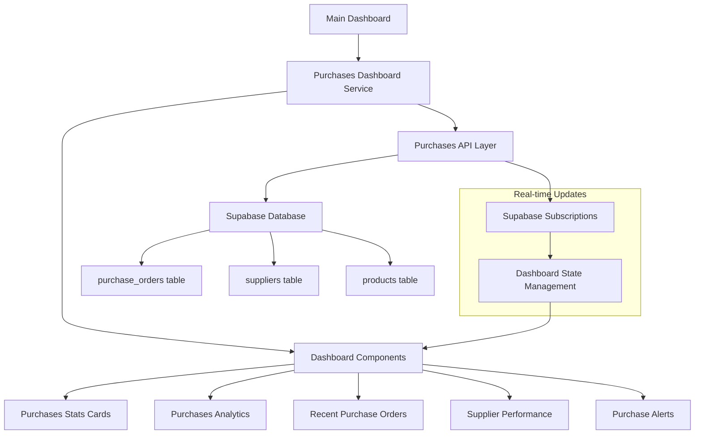

# Design Document

## Overview

This design document outlines the integration of real purchases data from the Supabase database into the main FBMS dashboard. The current dashboard displays static/mock data, but the system already has a comprehensive purchases API with suppliers, purchase orders, and receiving functionality. This integration will replace static data with live, real-time purchases metrics and analytics.

The design focuses on creating new dashboard components and services that fetch real data from the existing purchases API, while maintaining the current dashboard's responsive design and user experience patterns.

## Architecture

### High-Level Architecture



### Data Flow Architecture

1. **Dashboard Load**: Main dashboard requests purchases data from the new purchases dashboard service
2. **Data Aggregation**: Service fetches and aggregates data from multiple Supabase tables
3. **Real-time Updates**: Supabase subscriptions provide live updates to dashboard components
4. **User Interactions**: Click handlers navigate to detailed purchases module views
5. **Error Handling**: Graceful fallbacks and retry mechanisms for data loading failures

## Components and Interfaces

### 1. Purchases Dashboard Service

**File**: `src/services/purchasesDashboardService.ts`

```typescript
interface PurchasesDashboardData {
  metrics: PurchasesMetrics;
  recentOrders: PurchaseOrder[];
  supplierPerformance: SupplierPerformance[];
  alerts: PurchasesAlert[];
  analytics: PurchasesAnalytics;
}

interface PurchasesMetrics {
  totalPurchasesValue: number;
  totalPurchasesChange: number;
  activePurchaseOrders: number;
  pendingOrders: number;
  averageOrderValue: number;
  monthlySpending: number;
}

interface SupplierPerformance {
  supplierId: string;
  supplierName: string;
  totalOrders: number;
  totalValue: number;
  averageDeliveryTime: number;
  onTimeDeliveryRate: number;
  qualityRating: number;
}

interface PurchasesAlert {
  id: string;
  type: 'overdue' | 'pending_approval' | 'partial_delivery' | 'budget_exceeded';
  message: string;
  severity: 'low' | 'medium' | 'high' | 'critical';
  count: number;
  actionUrl?: string;
}

interface PurchasesAnalytics {
  monthlyTrends: MonthlyTrend[];
  statusDistribution: StatusDistribution[];
  categoryBreakdown: CategoryBreakdown[];
  yearOverYearComparison: YearOverYearData;
}
```

### 2. Enhanced Dashboard Components

#### A. Purchases Stats Cards Component

**File**: `src/components/dashboard/PurchasesStatsCards.tsx`

- Replaces static purchases data in existing StatsCard components
- Displays real-time purchases metrics with trend indicators
- Integrates with existing StatsCard styling and responsive design

#### B. Purchases Analytics Component

**File**: `src/components/dashboard/PurchasesAnalytics.tsx`

- Extends existing BusinessAnalytics component with purchases data
- Shows supplier performance metrics and spending trends
- Includes interactive charts using the existing Recharts library

#### C. Recent Purchase Orders Component

**File**: `src/components/dashboard/RecentPurchaseOrders.tsx`

- Integrates with existing RecentTransactions component structure
- Displays recent purchase orders with status indicators
- Provides click-through navigation to detailed purchase order views

#### D. Purchases Alerts Component

**File**: `src/components/dashboard/PurchasesAlerts.tsx`

- Integrates with existing alert system in the main dashboard
- Shows purchase-specific alerts (overdue orders, pending approvals, etc.)
- Uses existing alert styling and notification patterns

### 3. Data Integration Layer

#### A. Dashboard Data Hooks

**File**: `src/hooks/usePurchasesDashboardData.ts`

```typescript
interface UsePurchasesDashboardDataReturn {
  data: PurchasesDashboardData | null;
  loading: boolean;
  error: Error | null;
  refetch: () => Promise<void>;
}

export function usePurchasesDashboardData(): UsePurchasesDashboardDataReturn;
```

#### B. Real-time Subscriptions

**File**: `src/hooks/usePurchasesSubscriptions.ts`

- Manages Supabase real-time subscriptions for purchase orders and suppliers
- Automatically updates dashboard data when changes occur
- Handles subscription cleanup and error recovery

### 4. Updated Main Dashboard Integration

#### Modified Files:
- `src/components/Dashboard.tsx` - Integrate new purchases components
- `src/components/StatsCard.tsx` - Support dynamic data loading states
- `src/components/dashboard/BusinessAnalytics.tsx` - Include purchases analytics

## Data Models

### 1. Database Queries and Aggregations

#### Purchases Metrics Query
```sql
-- Total purchases value (current month)
SELECT 
  COUNT(*) as total_orders,
  SUM(total) as total_value,
  AVG(total) as average_order_value
FROM purchase_orders 
WHERE created_at >= date_trunc('month', CURRENT_DATE)
  AND status != 'cancelled';

-- Purchase orders by status
SELECT 
  status,
  COUNT(*) as count,
  SUM(total) as total_value
FROM purchase_orders 
GROUP BY status;
```

#### Supplier Performance Query
```sql
-- Supplier performance metrics
SELECT 
  s.id,
  s.name,
  COUNT(po.id) as total_orders,
  SUM(po.total) as total_value,
  AVG(EXTRACT(days FROM (po.received_date - po.created_at))) as avg_delivery_days,
  COUNT(CASE WHEN po.received_date <= po.expected_date THEN 1 END) * 100.0 / COUNT(*) as on_time_rate
FROM suppliers s
LEFT JOIN purchase_orders po ON s.id = po.supplier_id
WHERE s.is_active = true
  AND po.created_at >= CURRENT_DATE - INTERVAL '6 months'
GROUP BY s.id, s.name
ORDER BY total_value DESC;
```

### 2. Data Transformation Layer

#### Purchases Data Transformer
```typescript
class PurchasesDataTransformer {
  static transformMetrics(rawData: any[]): PurchasesMetrics;
  static transformSupplierPerformance(rawData: any[]): SupplierPerformance[];
  static transformAnalytics(rawData: any[]): PurchasesAnalytics;
  static generateAlerts(data: PurchasesDashboardData): PurchasesAlert[];
}
```

## Error Handling

### 1. Data Loading States

- **Loading State**: Show skeleton loaders for purchases sections
- **Error State**: Display user-friendly error messages with retry options
- **Empty State**: Show appropriate messages when no purchases data exists
- **Partial Data**: Handle cases where some data loads successfully but others fail

### 2. Fallback Mechanisms

- **Cache Strategy**: Implement local caching for purchases data with TTL
- **Offline Support**: Show last known data when network is unavailable
- **Progressive Loading**: Load critical metrics first, then detailed analytics
- **Graceful Degradation**: Hide purchases sections if data is completely unavailable

### 3. Error Recovery

```typescript
interface ErrorRecoveryStrategy {
  retryAttempts: number;
  retryDelay: number;
  fallbackToCache: boolean;
  showPartialData: boolean;
  notifyUser: boolean;
}
```

## Testing Strategy

### 1. Unit Tests

- **Service Layer Tests**: Test purchases dashboard service data aggregation
- **Component Tests**: Test dashboard components with mock purchases data
- **Hook Tests**: Test custom hooks for data fetching and subscriptions
- **Transformer Tests**: Test data transformation logic

### 2. Integration Tests

- **API Integration**: Test integration with existing purchases API
- **Database Queries**: Test Supabase queries for performance and accuracy
- **Real-time Updates**: Test Supabase subscription handling
- **Navigation**: Test click-through navigation to purchases module

### 3. Performance Tests

- **Load Testing**: Test dashboard performance with large datasets
- **Query Optimization**: Ensure database queries are optimized
- **Memory Usage**: Monitor memory usage with real-time subscriptions
- **Render Performance**: Test component rendering with frequent updates

### 4. User Experience Tests

- **Mobile Responsiveness**: Test purchases components on mobile devices
- **Loading States**: Test user experience during data loading
- **Error Scenarios**: Test user experience when errors occur
- **Accessibility**: Test screen reader compatibility and keyboard navigation

## Performance Considerations

### 1. Data Optimization

- **Query Optimization**: Use indexed queries and appropriate LIMIT clauses
- **Data Pagination**: Implement pagination for large datasets
- **Selective Loading**: Load only necessary data for dashboard display
- **Caching Strategy**: Implement intelligent caching with cache invalidation

### 2. Real-time Updates

- **Subscription Management**: Efficiently manage Supabase subscriptions
- **Update Throttling**: Throttle frequent updates to prevent UI flickering
- **Selective Updates**: Update only changed data sections
- **Connection Management**: Handle connection drops and reconnections

### 3. Component Performance

- **Memoization**: Use React.memo and useMemo for expensive calculations
- **Lazy Loading**: Lazy load non-critical purchases components
- **Virtual Scrolling**: Implement virtual scrolling for large lists
- **Debounced Updates**: Debounce rapid data updates

## Security Considerations

### 1. Data Access Control

- **Role-based Access**: Respect existing role-based access control
- **Data Filtering**: Filter purchases data based on user permissions
- **Sensitive Data**: Protect sensitive supplier and cost information
- **Audit Logging**: Log access to purchases dashboard data

### 2. API Security

- **Authentication**: Ensure all API calls are properly authenticated
- **Authorization**: Verify user permissions for purchases data access
- **Rate Limiting**: Implement rate limiting for dashboard data requests
- **Input Validation**: Validate all user inputs and parameters

### 3. Real-time Security

- **Subscription Security**: Secure Supabase real-time subscriptions
- **Data Validation**: Validate incoming real-time data
- **Connection Security**: Ensure secure WebSocket connections
- **User Context**: Maintain user context in real-time updates

## Mobile Responsiveness

### 1. Responsive Design Patterns

- **Mobile-first Approach**: Design purchases components mobile-first
- **Flexible Layouts**: Use CSS Grid and Flexbox for responsive layouts
- **Touch Interactions**: Optimize for touch interactions on mobile
- **Screen Size Adaptation**: Adapt component layouts for different screen sizes

### 2. Mobile-specific Features

- **Swipe Gestures**: Implement swipe gestures for mobile navigation
- **Touch-friendly Buttons**: Ensure minimum 44px touch targets
- **Mobile Charts**: Optimize charts for mobile viewing and interaction
- **Condensed Views**: Provide condensed views for small screens

### 3. Performance on Mobile

- **Reduced Data Loading**: Load less data on mobile connections
- **Image Optimization**: Optimize any images for mobile bandwidth
- **Lazy Loading**: Implement aggressive lazy loading on mobile
- **Offline Capabilities**: Enhanced offline support for mobile users