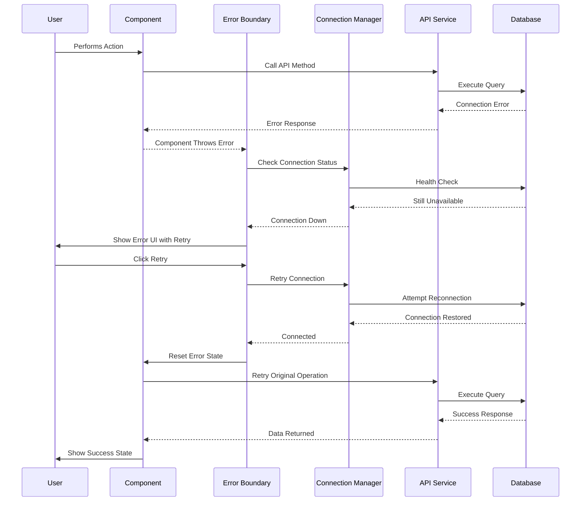

# Design Document: Remove Mock Data Integration

## Overview

This design document outlines the comprehensive removal of mock data from the FBMS system, transitioning from a three-mode architecture (Local Supabase, Cloud Supabase, Mock Data) to a robust two-mode architecture that ensures live database integration while maintaining system reliability through proper error handling and graceful degradation strategies.

### Design Goals
- Eliminate mock data mode entirely from production code
- Ensure 100% live database integration for all business operations
- Implement robust error handling when database connectivity fails
- Maintain development and testing capabilities through proper test infrastructure
- Create a more secure and predictable system behavior
- Preserve system usability with graceful degradation strategies

### Scope
- Remove all mock data fallbacks from API services
- Refactor component error handling to handle database failures
- Implement connection retry mechanisms and health checks
- Design proper loading states and user feedback systems
- Maintain test mocks for development/testing environments only

## Architecture Design

### Current System Architecture


### New Target Architecture


### Data Flow Diagram


## Component Design

### Database Connection Manager

**Responsibilities:**
- Monitor database connection health
- Implement connection retry logic with exponential backoff
- Provide connection status to components
- Manage connection state transitions

**Interfaces:**
```typescript
interface DatabaseConnectionManager {
  isConnected: boolean;
  connectionStatus: 'connected' | 'connecting' | 'disconnected' | 'error';
  checkConnection(): Promise<boolean>;
  retryConnection(options?: RetryOptions): Promise<boolean>;
  onStatusChange(callback: (status: ConnectionStatus) => void): void;
}
```

**Dependencies:**
- Supabase client
- Error handling utilities
- Retry logic service

### Error Boundary System

**Responsibilities:**
- Catch and handle database-related errors
- Provide fallback UI for failed operations
- Offer retry mechanisms to users
- Log errors for monitoring

**Interfaces:**
```typescript
interface ErrorBoundaryProps {
  fallback: React.ComponentType<ErrorFallbackProps>;
  onError?: (error: Error, errorInfo: ErrorInfo) => void;
  enableRetry?: boolean;
  children: React.ReactNode;
}

interface ErrorFallbackProps {
  error: Error;
  resetError: () => void;
  hasRetry: boolean;
}
```

**Dependencies:**
- React Error Boundary
- Notification system
- Logging service

### API Service Layer

**Responsibilities:**
- Execute database operations exclusively
- Handle database errors with proper error codes
- Implement request validation
- Provide standardized error responses

**Interfaces:**
```typescript
interface APIService<T> {
  create(data: Omit<T, 'id' | 'createdAt' | 'updatedAt'>): Promise<APIResponse<T>>;
  read(id: string): Promise<APIResponse<T>>;
  update(id: string, data: Partial<T>): Promise<APIResponse<T>>;
  delete(id: string): Promise<APIResponse<void>>;
  list(options?: ListOptions): Promise<APIResponse<T[]>>;
}

interface APIResponse<T> {
  data: T | null;
  error: APIError | null;
  meta?: ResponseMetadata;
}
```

**Dependencies:**
- Supabase client
- Input validation
- Error handling utilities

### Loading State Manager

**Responsibilities:**
- Manage loading states across components
- Provide consistent loading UI patterns
- Handle timeout scenarios
- Coordinate multiple simultaneous requests

**Interfaces:**
```typescript
interface LoadingStateManager {
  setLoading(key: string, loading: boolean): void;
  isLoading(key: string): boolean;
  getLoadingKeys(): string[];
  clearAll(): void;
}
```

**Dependencies:**
- Global state management
- Component state synchronization

## Data Model

### Core Data Structure Definitions

```typescript
// Database Connection State
interface ConnectionState {
  status: 'connected' | 'connecting' | 'disconnected' | 'error';
  lastConnected: Date | null;
  retryCount: number;
  error: Error | null;
}

// Error Handling Types
interface DatabaseError extends Error {
  code: string;
  severity: 'low' | 'medium' | 'high' | 'critical';
  recoverable: boolean;
  context: Record<string, unknown>;
}

// API Response Types
interface APIResponse<T> {
  data: T | null;
  error: APIError | null;
  meta: {
    timestamp: Date;
    requestId: string;
    duration: number;
  };
}

// Retry Configuration
interface RetryOptions {
  maxAttempts: number;
  baseDelay: number;
  maxDelay: number;
  backoffMultiplier: number;
}

// Component Error State
interface ComponentErrorState {
  hasError: boolean;
  error: Error | null;
  errorBoundary: string | null;
  retryCount: number;
  lastRetry: Date | null;
}
```

### Data Model Diagram


## Business Process

### Process 1: Application Startup Without Mock Data


### Process 2: Data Operation Error Handling


### Process 3: Component Error Recovery



## Error Handling Strategy

### Database Connection Failures

**Immediate Response:**
- Display connection error UI with clear messaging
- Provide retry action buttons
- Show connection status indicator

**Retry Logic:**
- Implement exponential backoff (1s, 2s, 4s, 8s, 16s)
- Maximum 5 retry attempts per operation
- Reset retry counter on successful connection

**User Experience:**
- Non-blocking error messages
- Preserve user input during connection issues
- Allow manual retry at any time

### Data Operation Failures

**Validation Errors:**
- Show field-specific error messages
- Highlight problematic inputs
- Provide correction suggestions

**Permission Errors:**
- Clear messaging about access requirements
- Redirect to appropriate authentication flow
- Log security events for monitoring

**Server Errors:**
- Generic user-friendly messages
- Detailed logging for debugging
- Automatic error reporting to monitoring systems

### Component-Level Error Boundaries

**Scope:**
- Wrap each major feature module
- Contain errors to specific components
- Maintain application stability

**Fallback UI:**
- Show component-specific error messages
- Provide navigation back to working areas
- Include retry mechanisms where appropriate

## Testing Strategy

### Unit Testing
- Mock Supabase client for isolated component testing
- Test error handling paths without real database
- Validate retry logic with controlled failures
- Test loading state management

### Integration Testing
- Use test database for real integration scenarios
- Test error boundary behavior with simulated failures
- Verify connection retry mechanisms
- Test graceful degradation flows

### End-to-End Testing
- Test complete user workflows with database connectivity
- Simulate network failures and recovery
- Verify error UI displays correctly
- Test offline-to-online transitions

### Test Environment Separation

```typescript
// Test-only mock configuration
const mockSupabaseClient = {
  from: jest.fn(),
  auth: {
    getUser: jest.fn(),
    getSession: jest.fn()
  }
};

// Production database configuration
const productionSupabaseClient = createClient(
  process.env.SUPABASE_URL!,
  process.env.SUPABASE_ANON_KEY!
);
```

## Performance and Monitoring

### Connection Health Monitoring

```typescript
class ConnectionHealthMonitor {
  private healthChecks: HealthCheck[] = [];
  private metrics: ConnectionMetrics = new ConnectionMetrics();
  
  async performHealthCheck(): Promise<HealthStatus> {
    const startTime = performance.now();
    try {
      await supabase.from('health_check').select('1').limit(1);
      const duration = performance.now() - startTime;
      this.metrics.recordSuccess(duration);
      return { status: 'healthy', responseTime: duration };
    } catch (error) {
      this.metrics.recordFailure(error);
      return { status: 'unhealthy', error };
    }
  }
}
```

### Performance Metrics

- Database response times
- Connection failure rates
- Error boundary activation frequency
- User retry attempt patterns
- Recovery success rates

### Caching Strategy

- Implement intelligent caching for read operations
- Cache critical data during connection issues
- Invalidate cache on successful writes
- Provide cache status indicators to users

## Implementation Phases

### Phase 1: Foundation (Week 1-2)
- Remove mock data from API services
- Implement basic error boundaries
- Create connection manager
- Update environment configuration

### Phase 2: Error Handling (Week 2-3)
- Implement comprehensive error handling
- Add retry mechanisms
- Create graceful degradation UI
- Update component error states

### Phase 3: User Experience (Week 3-4)
- Implement loading state management
- Create consistent error messaging
- Add connection status indicators
- Implement offline UI patterns

### Phase 4: Testing & Monitoring (Week 4-5)
- Complete test suite updates
- Implement performance monitoring
- Add health check endpoints
- Create error reporting system

### Phase 5: Deployment & Validation (Week 5-6)
- Staged deployment to test environments
- Monitor system behavior
- Performance validation
- User acceptance testing

## Security Considerations

### Authentication Requirements
- All database operations require valid authentication
- No bypass mechanisms for unauthorized access
- Proper session management and token handling

### Error Information Disclosure
- Sanitize error messages shown to users
- Avoid exposing database schema information
- Log detailed errors securely for debugging

### Connection Security
- Enforce HTTPS for all database connections
- Validate SSL certificates
- Implement proper connection timeouts

## Migration Strategy

### Code Removal Plan
1. Identify all mock data implementations
2. Remove mock data fallbacks from API services
3. Update component error handling
4. Remove mock data constants and utilities
5. Update tests to use proper mocking

### Rollback Plan
- Maintain feature flags for emergency rollback
- Keep removed code in version control
- Implement gradual rollout strategy
- Monitor system metrics during migration

## Success Metrics

### Technical Metrics
- 0% mock data usage in production
- < 2 second average database response time
- > 99.5% successful database operations
- < 5% error boundary activation rate

### User Experience Metrics
- User satisfaction with error handling
- Reduced support tickets about data inconsistency
- Faster application performance
- Improved system reliability

This design ensures a robust, secure, and reliable FBMS system that operates exclusively with live database integration while providing excellent error handling and user experience during connectivity issues.