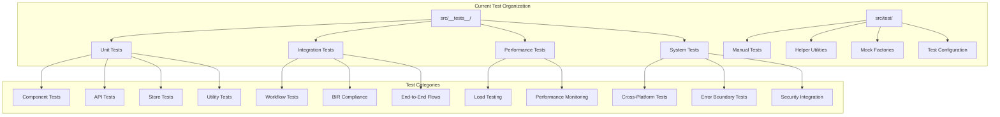
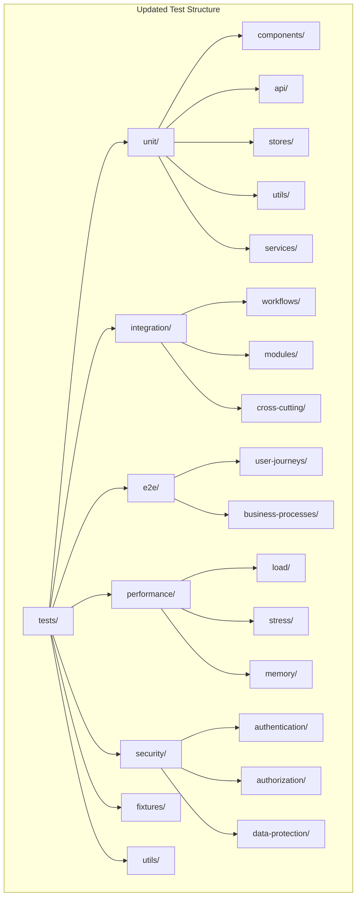
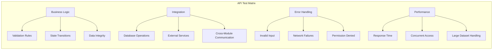
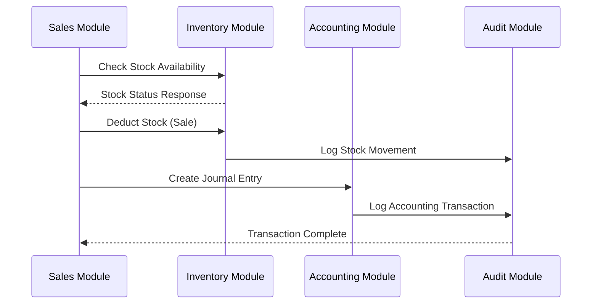
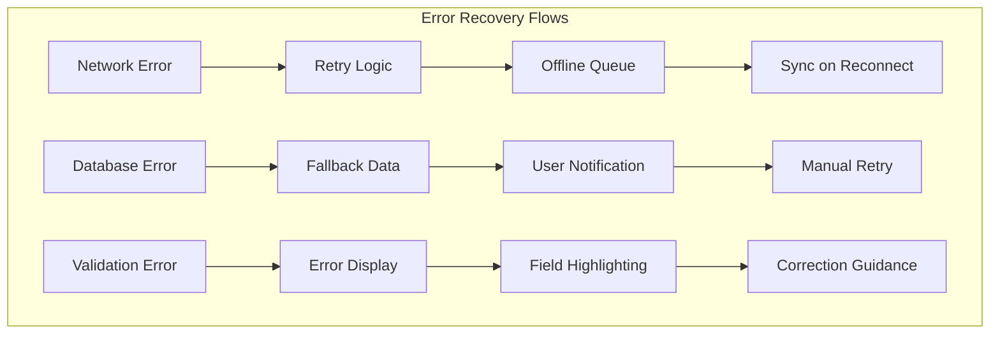

# Test Suite Update Design

## Overview

This document outlines a comprehensive update to the test suite for the Filipino Business Management System (FBMS), ensuring complete coverage of all current functionality, modernizing test patterns, and establishing a robust testing architecture that aligns with the project's current structure.

## Current Test Environment Analysis

### Technology Stack
- **Testing Framework**: Vitest 1.6.0 with JSDOM environment
- **Testing Libraries**: React Testing Library, @testing-library/jest-dom
- **Coverage**: @vitest/coverage-v8 with text, JSON, and HTML reports
- **Configuration**: 30-second test timeout, 10-second hook timeout
- **Mock Strategy**: Comprehensive mocking of external dependencies

### Current Test Structure Assessment



## Test Suite Architecture Redesign

### Testing Strategy Overview

The updated test suite will follow a layered testing approach with comprehensive coverage across all system components:

1. **Unit Testing Layer** - Individual component and function testing
2. **Integration Testing Layer** - Module interaction and workflow testing  
3. **End-to-End Testing Layer** - Complete user journey validation
4. **Performance Testing Layer** - Load and stress testing
5. **Security Testing Layer** - Authentication and authorization validation

### Test Organization Structure



## API Testing Coverage

### Core API Modules Testing

#### Purchase Order API Testing
- **CRUD Operations**: Create, read, update, delete purchase orders
- **Status Transitions**: Draft → Sent → Approved → Received
- **Validation Logic**: Item validation, quantity checks, supplier verification
- **Audit Trail**: Status change logging, user action tracking
- **Partial Receiving**: Multi-step receiving process validation
- **Approval Workflow**: Multi-level approval system testing

#### Inventory Management API Testing
- **Stock Movement Tracking**: Add, subtract, set operations with audit
- **Multi-Location Support**: Stock transfers between locations
- **Batch/Lot Tracking**: Expiry date handling, batch number validation
- **Reorder Point Logic**: Automatic reorder trigger testing
- **Valuation Methods**: FIFO, LIFO, Average cost calculations

#### Sales & POS API Testing
- **Transaction Processing**: Sale creation, payment handling
- **Inventory Integration**: Stock deduction, availability checks
- **Customer Management**: CRUD operations, loyalty points
- **Payment Methods**: Cash, card, split payments
- **Receipt Generation**: Invoice numbering, tax calculations

### API Test Categories



## Component Testing Strategy

### Core Component Categories

#### Dashboard Components
- **Dashboard.tsx**: Main dashboard rendering and data aggregation
- **StatsCard.tsx**: Statistical display components
- **SalesChart.tsx**: Chart rendering and data visualization
- **RecentTransactions.tsx**: Transaction history display
- **QuickActions.tsx**: Action button functionality

#### POS System Components
- **EnhancedPOSSystem.tsx**: Complete POS workflow testing
- **CustomerSelector.tsx**: Customer search and selection
- **PaymentModal.tsx**: Payment processing interface
- **ProductSearch.tsx**: Product lookup and barcode scanning
- **ReceiptGenerator.tsx**: Receipt formatting and printing

#### Inventory Components
- **ProductForm.tsx**: Product creation and editing
- **StockMovement.tsx**: Inventory adjustment interfaces
- **TransferSlip.tsx**: Inter-location transfer management
- **InventoryReport.tsx**: Stock level reporting

### Component Test Patterns

```typescript
// Example Component Test Structure
describe('EnhancedPOSSystem', () => {
  describe('Component Rendering', () => {
    it('should render POS interface correctly')
    it('should display customer selector when needed')
    it('should show cart items properly')
  })
  
  describe('User Interactions', () => {
    it('should add products to cart')
    it('should handle quantity adjustments')
    it('should process payments correctly')
  })
  
  describe('Business Logic', () => {
    it('should validate stock availability')
    it('should calculate totals correctly')
    it('should handle discounts properly')
  })
  
  describe('Error Scenarios', () => {
    it('should handle insufficient stock')
    it('should manage payment failures')
    it('should recover from network errors')
  })
})
```

## Integration Testing Workflows

### Business Process Testing

#### Sales Workflow Integration
1. **Product Selection** → Cart Addition → Stock Validation
2. **Customer Selection** → Discount Application → Total Calculation
3. **Payment Processing** → Inventory Update → Receipt Generation
4. **Transaction Recording** → Accounting Entry → Audit Logging

#### Purchase Order Workflow Integration
1. **PO Creation** → Supplier Validation → Item Verification
2. **Approval Process** → Multi-level Approval → Status Updates
3. **Receiving Process** → Partial Receipts → Inventory Updates
4. **Invoice Matching** → Payment Processing → Completion

#### Inventory Management Integration
1. **Stock Adjustment** → Audit Trail → Valuation Update
2. **Location Transfer** → Dual-entry Recording → Validation
3. **Reorder Processing** → Supplier Communication → PO Generation

### Cross-Module Integration Tests



## Test Data Management

### Test Data Factory Pattern

```typescript
// Enhanced Test Data Factory
export class TestDataFactory {
  static createProduct(overrides?: Partial<Product>): Product {
    return {
      id: generateTestId(),
      name: 'Test Product',
      sku: generateSKU(),
      price: 100,
      cost: 50,
      stock: 25,
      minStock: 5,
      category: 'Test Category',
      isActive: true,
      createdAt: new Date(),
      updatedAt: new Date(),
      ...overrides
    }
  }
  
  static createCustomer(overrides?: Partial<Customer>): Customer {
    return {
      id: generateTestId(),
      firstName: 'Juan',
      lastName: 'Dela Cruz',
      email: 'juan@test.com',
      phone: '+639123456789',
      isActive: true,
      createdAt: new Date(),
      ...overrides
    }
  }
  
  static createSale(overrides?: Partial<Sale>): Sale {
    return {
      id: generateTestId(),
      customerId: generateTestId(),
      items: [this.createSaleItem()],
      subtotal: 100,
      tax: 12,
      total: 112,
      paymentMethod: 'cash',
      status: 'completed',
      createdAt: new Date(),
      ...overrides
    }
  }
}
```

### Database Test Isolation

#### Test Database Strategy
- **Separate Test Database**: Isolated test environment
- **Transaction Rollback**: Automatic cleanup after each test
- **Seed Data Management**: Consistent baseline data
- **Snapshot Testing**: Database state validation

## Performance Testing Framework

### Load Testing Scenarios

#### High-Traffic Scenarios
- **Concurrent Sales**: Multiple POS terminals processing simultaneously
- **Bulk Inventory Updates**: Large-scale stock adjustments
- **Report Generation**: Heavy analytical queries under load
- **User Authentication**: Login/logout stress testing

#### Performance Metrics
- **Response Time**: API endpoint response times under load
- **Memory Usage**: Component memory consumption monitoring
- **Bundle Size**: JavaScript bundle optimization verification
- **Database Performance**: Query execution time analysis

### Performance Test Implementation

```typescript
// Performance Test Example
describe('POS Performance Tests', () => {
  test('should handle 100 concurrent sales', async () => {
    const startTime = performance.now()
    
    const salesPromises = Array.from({ length: 100 }, () =>
      processSale(createTestSale())
    )
    
    const results = await Promise.all(salesPromises)
    const endTime = performance.now()
    
    expect(results).toHaveLength(100)
    expect(results.every(r => r.success)).toBe(true)
    expect(endTime - startTime).toBeLessThan(5000) // 5 second limit
  })
})
```

## Security Testing Implementation

### Authentication Testing
- **JWT Token Validation**: Token expiry, refresh, invalidation
- **Session Management**: Concurrent session handling
- **Password Security**: Strength validation, hashing verification
- **Social Authentication**: OAuth flow testing

### Authorization Testing
- **Role-Based Access**: Admin, manager, cashier permission validation
- **Resource Protection**: API endpoint access control
- **Data Isolation**: User-specific data access verification
- **Cross-Tenant Security**: Multi-business data separation

### Security Test Framework

```typescript
// Security Test Examples
describe('Authentication Security', () => {
  test('should reject expired JWT tokens', async () => {
    const expiredToken = generateExpiredToken()
    const response = await apiCall('/protected-endpoint', { 
      token: expiredToken 
    })
    expect(response.status).toBe(401)
  })
  
  test('should enforce role-based access control', async () => {
    const cashierToken = generateCashierToken()
    const response = await apiCall('/admin/users', { 
      token: cashierToken 
    })
    expect(response.status).toBe(403)
  })
})
```

## Error Handling & Recovery Testing

### Error Boundary Testing
- **Component Error Recovery**: Graceful component failure handling
- **Network Failure Simulation**: Offline functionality validation
- **Database Connection Issues**: Connection retry mechanisms
- **User Input Validation**: Invalid data handling

### Recovery Scenario Testing



## Test Automation & CI/CD Integration

### Automated Test Execution
- **Pre-commit Hooks**: Unit test execution before commits
- **Pull Request Validation**: Comprehensive test suite on PR
- **Deployment Pipeline**: Integration tests before deployment
- **Scheduled Testing**: Nightly performance and security tests

### Test Reporting & Monitoring

#### Coverage Requirements
- **Line Coverage**: Minimum 80% for critical modules
- **Branch Coverage**: 70% for business logic paths
- **Function Coverage**: 90% for public API methods
- **Integration Coverage**: 100