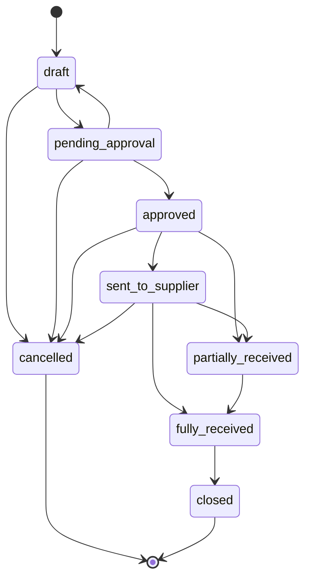

# Purchase Order Enhanced Schema Migration Guide

## Overview

This document describes the database migration `20250808120000_enhance_purchase_order_schema.sql` that enhances the purchase order system with improved workflow management, partial receiving capabilities, and comprehensive audit trails.

## Migration Details

### Migration File
- **File**: `supabase/migrations/20250808120000_enhance_purchase_order_schema.sql`
- **Version**: 1.0.0
- **Date**: 2025-08-08
- **Task ID**: 12 - Database migrations for enhanced schema

### What This Migration Does

1. **Enhances Purchase Orders Table** with new workflow fields
2. **Adds Receiving Tracking** to purchase order items
3. **Creates New Tables** for detailed receiving records
4. **Implements Triggers** for automatic status updates
5. **Adds Performance Indexes** for optimized queries
6. **Preserves Existing Data** with safe migration strategies

## Schema Changes

### 1. Enhanced Purchase Orders Table

New columns added to `purchase_orders`:

```sql
-- Workflow fields
enhanced_status TEXT DEFAULT 'draft' CHECK (enhanced_status IN (...))
approval_required BOOLEAN DEFAULT FALSE
approved_by UUID REFERENCES auth.users(id)
approved_at TIMESTAMP WITH TIME ZONE

-- Receiving tracking
total_received_items INTEGER DEFAULT 0
total_pending_items INTEGER DEFAULT 0
last_received_date TIMESTAMP WITH TIME ZONE

-- Additional tracking
expected_delivery_date TIMESTAMP WITH TIME ZONE
actual_delivery_date TIMESTAMP WITH TIME ZONE
supplier_reference TEXT
internal_notes TEXT
attachments JSONB DEFAULT '[]'::jsonb
```

### 2. Enhanced Purchase Order Items Table

The `purchase_order_items` table is created/enhanced with:

```sql
-- Core receiving fields
received_quantity INTEGER DEFAULT 0 CHECK (received_quantity >= 0)
pending_quantity INTEGER GENERATED ALWAYS AS (quantity - received_quantity) STORED

-- Quality and tracking
quality_status TEXT DEFAULT 'pending' CHECK (quality_status IN ('pending', 'approved', 'rejected'))
batch_number TEXT
expiry_date TIMESTAMP WITH TIME ZONE
serial_numbers JSONB DEFAULT '[]'::jsonb

-- Constraints
CONSTRAINT received_quantity_not_exceed_ordered CHECK (received_quantity <= quantity)
```

### 3. New Receiving Line Items Table

```sql
CREATE TABLE purchase_order_receiving_line_items (
    id UUID PRIMARY KEY DEFAULT gen_random_uuid(),
    purchase_order_item_id UUID NOT NULL REFERENCES purchase_order_items(id) ON DELETE CASCADE,
    receiving_record_id UUID NOT NULL REFERENCES purchase_order_receiving_records(id) ON DELETE CASCADE,
    
    -- Receiving details
    quantity_received INTEGER NOT NULL CHECK (quantity_received > 0),
    unit_cost NUMERIC(15,4) NOT NULL CHECK (unit_cost >= 0),
    total_cost NUMERIC(15,4) GENERATED ALWAYS AS (quantity_received * unit_cost) STORED,
    condition TEXT NOT NULL DEFAULT 'good' CHECK (condition IN ('good', 'damaged', 'expired', 'returned')),
    
    -- Tracking information
    batch_number TEXT,
    expiry_date TIMESTAMP WITH TIME ZONE,
    serial_numbers JSONB DEFAULT '[]'::jsonb,
    location TEXT,
    
    -- Audit fields
    received_by UUID NOT NULL REFERENCES auth.users(id),
    received_by_name TEXT,
    received_date TIMESTAMP WITH TIME ZONE NOT NULL,
    created_at TIMESTAMP WITH TIME ZONE DEFAULT NOW()
);
```

## Enhanced Status Workflow

The new `enhanced_status` field supports these states:

1. **`draft`** - Being created/edited
2. **`pending_approval`** - Awaiting approval
3. **`approved`** - Approved for ordering
4. **`sent_to_supplier`** - Sent to supplier
5. **`partially_received`** - Some items received
6. **`fully_received`** - All items received
7. **`cancelled`** - Cancelled order
8. **`closed`** - Completed and closed

### Valid Transitions



## Automatic Features

### 1. Trigger-Based Status Updates

The migration includes triggers that automatically:

- Update `total_received_items` and `total_pending_items` when items are received
- Change status to `partially_received` when any items are received
- Change status to `fully_received` when all items are received
- Update `last_received_date` when receiving occurs

### 2. Generated Columns

- `pending_quantity` is automatically calculated as `quantity - received_quantity`
- `total_cost` in receiving line items is calculated automatically

## Data Migration Strategy

### 1. Backup Creation
```sql
CREATE TABLE purchase_orders_backup_20250808 AS SELECT * FROM purchase_orders;
```

### 2. Status Migration
```sql
UPDATE purchase_orders 
SET enhanced_status = CASE 
    WHEN status = 'draft' THEN 'draft'
    WHEN status = 'sent' THEN 'sent_to_supplier' 
    WHEN status = 'received' THEN 'fully_received'
    WHEN status = 'partial' THEN 'partially_received'
    WHEN status = 'cancelled' THEN 'cancelled'
    ELSE 'draft'
END;
```

### 3. Receiving Counters Initialization
```sql
UPDATE purchase_orders 
SET 
    total_pending_items = (SELECT COALESCE(SUM(quantity), 0) FROM purchase_order_items WHERE purchase_order_id = purchase_orders.id),
    total_received_items = 0;
```

## Performance Optimizations

### Indexes Created

```sql
-- Purchase Orders indexes
CREATE INDEX idx_po_enhanced_status ON purchase_orders(enhanced_status);
CREATE INDEX idx_po_approved_by ON purchase_orders(approved_by);
CREATE INDEX idx_po_expected_delivery ON purchase_orders(expected_delivery_date);
CREATE INDEX idx_po_last_received ON purchase_orders(last_received_date);

-- Purchase Order Items indexes
CREATE INDEX idx_poi_po_id ON purchase_order_items(purchase_order_id);
CREATE INDEX idx_poi_received_qty ON purchase_order_items(received_quantity);
CREATE INDEX idx_poi_quality_status ON purchase_order_items(quality_status);
CREATE INDEX idx_poi_batch_number ON purchase_order_items(batch_number);

-- Receiving Line Items indexes
CREATE INDEX idx_prli_poi_id ON purchase_order_receiving_line_items(purchase_order_item_id);
CREATE INDEX idx_prli_received_by ON purchase_order_receiving_line_items(received_by);
CREATE INDEX idx_prli_received_date ON purchase_order_receiving_line_items(received_date);
```

## Security

### Row Level Security (RLS)
- All new tables have RLS enabled
- Policies allow authenticated users to manage records
- Existing security model is maintained

### Data Integrity
- Foreign key constraints ensure referential integrity
- Check constraints prevent invalid data
- Triggers maintain data consistency

## Running the Migration

### Prerequisites
- Supabase CLI installed and configured
- Local Supabase instance running (if using local development)
- Backup of existing data (created automatically by migration)

### Steps

1. **Apply Migration**
   ```bash
   supabase db push
   ```

2. **Validate Migration**
   ```bash
   npm run validate-po-migration
   ```

3. **Run Tests**
   ```bash
   npm run test src/test/unit/database/purchaseOrderSchemaMigration.test.ts
   npm run test src/test/integration/purchaseOrder/purchaseOrderMigrationIntegration.test.ts
   ```

## Testing

### Unit Tests
Located in: `src/test/unit/database/purchaseOrderSchemaMigration.test.ts`

Tests cover:
- Table structure validation
- Constraint enforcement
- Trigger functionality
- Data migration accuracy
- Performance characteristics

### Integration Tests
Located in: `src/test/integration/purchaseOrder/purchaseOrderMigrationIntegration.test.ts`

Tests cover:
- Complete purchase order lifecycle
- API integration with enhanced schema
- Concurrent operations handling
- Error recovery scenarios

### Validation Script
Located in: `src/scripts/validatePurchaseOrderMigration.ts`

Validates:
- Table structure completeness
- Constraint enforcement
- Index creation and performance
- Trigger functionality
- Data integrity
- Permission setup

## Rollback Plan

If rollback is needed:

1. **Restore from Backup**
   ```sql
   -- Restore purchase orders
   DELETE FROM purchase_orders;
   INSERT INTO purchase_orders SELECT * FROM purchase_orders_backup_20250808;
   
   -- Drop new tables
   DROP TABLE purchase_order_receiving_line_items;
   -- Note: purchase_order_items table should be carefully handled
   ```

2. **Remove Enhanced Columns**
   ```sql
   ALTER TABLE purchase_orders DROP COLUMN IF EXISTS enhanced_status;
   ALTER TABLE purchase_orders DROP COLUMN IF EXISTS approval_required;
   -- ... (continue for all new columns)
   ```

## Monitoring

### Key Metrics to Monitor
- Purchase order status distribution
- Average receiving time
- Trigger execution performance
- Query performance on indexed columns

### Health Checks
- Run validation script daily
- Monitor constraint violation logs
- Check for orphaned records
- Verify trigger execution

## Support

### Common Issues

1. **Migration Fails with Constraint Errors**
   - Check for existing invalid data
   - Run data cleanup before migration

2. **Performance Issues After Migration**
   - Verify all indexes were created
   - Run `ANALYZE` on affected tables
   - Check query plans

3. **Trigger Not Firing**
   - Verify trigger functions exist
   - Check for permission issues
   - Review trigger conditions

### Troubleshooting Commands

```sql
-- Check migration status
SELECT * FROM supabase_migrations.schema_migrations 
WHERE version = '20250808120000';

-- Verify table structure
\d purchase_orders
\d purchase_order_items

-- Check constraints
SELECT conname, contype FROM pg_constraint 
WHERE conrelid = 'purchase_orders'::regclass;

-- Verify indexes
SELECT indexname, tablename FROM pg_indexes 
WHERE tablename LIKE '%purchase_order%';
```

## Documentation Updates

After migration, update:
- API documentation for new fields
- Frontend component interfaces
- Business logic documentation
- User training materials

## Conclusion

This migration significantly enhances the purchase order system with:
- ✅ Comprehensive workflow management
- ✅ Partial receiving capabilities
- ✅ Detailed audit trails
- ✅ Performance optimizations
- ✅ Data integrity safeguards
- ✅ Backward compatibility

The enhanced schema provides a solid foundation for advanced purchase order management while maintaining the existing system's reliability and performance.